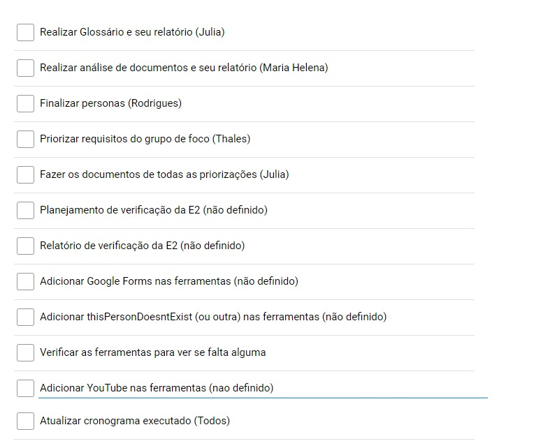

# Reunião 20/11/2024

Início: 15:50 | Fim: 17:25
<!-- Este é um arquivo base, para criar uma ata, basta copiá-lo e preencher os dados da reunião -->

## Participantes Convocados

<!-- Colocar um ✅ se o participante estiver presente ou um ❌ caso negativo -->
Na Tabela 1, são apresentados os participantes da reunião juntamente com os indicadores que demonstram se estão presentes ou não, onde ✅ significa que o participante está presente e ❌ significa que o participante não compareceu à reunião.

Tabela 1: Participantes Convocados e Presença na Reunião

<table align="center">
  <tr>
    <th>Nome</th><th>Matrícula</th><th>Presente</th>
  </tr>
  <tr><td>Júlia Takaki</td><td>221029249</td><td>✅</td></tr>
  <tr><td>Maria Helena</td><td>222006982</td><td>✅</td></tr>
  <tr><td>Thales Euflauzino</td><td>222006178</td><td>✅</td></tr>
  <tr><td>Victor Rodrigues</td><td>211063256</td><td>✅</td></tr>
  <tr><td>Víctor Schmidt</td><td>222021924</td><td>✅</td></tr>
</table>

Autor: [Víctor Schmidt](https://github.com/moonshinerd)

## Pautas

<!-- pautas discutidas na reunião -->

- Acompanhamento do desenvolvimento das atividades estipuladas por parte dos membros

## Atualizações de Cada Membro

Foram dadas as seguintes instruções para elaboração da atualização:

1. Responda às perguntas abaixo no grupo.  
2. Seja claro e objetivo para facilitar o acompanhamento.  
3. Caso necessário, mencione pessoas ou tarefas específicas.  

Perguntas:

1. Como está o andamento das suas atividades?  
   Descreva o progresso atual e o status das suas tarefas
2. Você precisa de ajuda com algo?
   Mencione qualquer dificuldade ou suporte necessário
3. Recomendações sobre o que falta fazer na sua atividade ou em outra atividade relacionada:
   Sugira ações ou próximos passos que podem ajudar a equipe

### Julia Takaki
1. Como está o andamento das suas atividades?  
   Fiz o questionário de perfil do usuário e irei iniciar o glossário.

2. Você precisa de ajuda com algo?
   Acredito que não.

3. Recomendações sobre o que falta fazer na sua atividade ou em outra atividade relacionada:
   Preciso esperar as respostas do questionário para recolher e analisar, talvez atrase um pouco.
   
### Maria Helena

1. Como está o andamento das suas atividades?  
   Fiz as correções do cronograma e agora estou fazendo a etapa de análise de documentos.

2. Você precisa de ajuda com algo?
   Por enquanto tá tudo tranquilo.

3. Recomendações sobre o que falta fazer na sua atividade ou em outra atividade relacionada:
   Por enquanto o andamento das atividades tão correndo bem, só realmente finalizar tudo e gravar a apresentação.

### Thales Euflauzino

1. Como está o andamento das suas atividades?  
   Acredito que finalizei, realizei o grupo focal e também já fiz o relatório, provavelmente a única coisa que não está concluída é a priorização dos requisitos elicitados no grupo focal.

2. Você precisa de ajuda com algo?
   Não sei se vou conseguir realizar a priorização do grupo focal a tempo, talvez eu precise de ajuda de alguém

3. Recomendações sobre o que falta fazer na sua atividade ou em outra atividade relacionada:
   mandarei a foto do todo abaixo

[**Figura 1:** Checklist - Elicitação de Requisitos](https://www.checkli.com/checklists/view/673e2fc796737)

_Autor: [Thales Euflauzino](https://github.com/thaleseuflauzino)_

### Victor Rodrigues

1. Como está o andamento das suas atividades?  
   Perfil de usuário acredito que esteja pronto, preciso apenas arrumar alguns detalhes (adição em ferramentas, atualização do cronograma executado e mais alguns detalhes)
Personas estou terminando de construir, vou pegar as imagens e adicionar ao docs
2. Você precisa de ajuda com algo?
   apenas alguem para revisar quando eu terminar
3. Recomendações sobre o que falta fazer na sua atividade ou em outra atividade relacionada:
   Citei uma pagina de questionários, mas ainda está sem caminho e não existe 

### Víctor Schmidt

1. Como está o andamento das suas atividades?  
   Conclui as minhas duas atividades, introspecção e Brainstorm.

2. Você precisa de ajuda com algo?
   Não, mas se alguém precisar de ajuda de forma urgente estou aqui

3. Recomendações sobre o que falta fazer na sua atividade ou em outra atividade relacionada:
   Só falta gravar a apresentação dessa entrega

## Histórico de versões

| Versão | Data | Descrição | Autor(es) | Revisor(es) |
| ------ | ---- | --------- | --------- | ----------- |
|`1.0`|20/11/2024| Estruturação inicial e preenchimento| [Víctor Schmidt](https://github.com/moonshinerd) | [Júlia Takaki](https://github.com/juliatakaki) |

