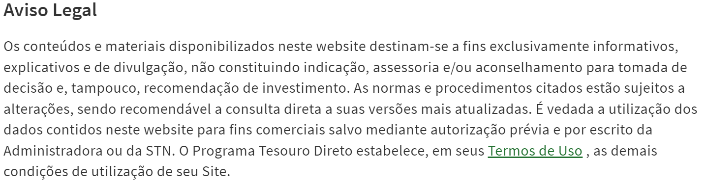

## Introdução 

No início do processo da disciplina, o grupo examinou uma série de aplicativos sugeridos por cada membro, discutindo os prós e contras de cada um. Foi feita uma análise minuciosa com base nos critérios definidos para selecionar o aplicativo que melhor se encaixasse no projeto.

### Critérios para escolha

- App não foi trabalhado anteriormente na disciplina;
- Fácil acesso ao público alvo;
- Disponibilidade de informações;
- Complexidade do aplicativo.

### Motivações de escolha 

Com base nos critérios anteriores, o grupo se reuniu e decidiu que seria usado o [Tesouro Direto](https://www.tesourodireto.com.br). A escolha se deu por ser um aplicativo de complexidade média, porém com muitas funcionalidades para explorarmos ao longo do projeto. O público-alvo é grande e facilmente acessível, além de não ter sido utilizado para estudos na disciplina.

### Rich Picture
[Figura 1: Rich Picture](../assets/RichPictureTesouroDireto.png)
Autor: Júlia Takaki

### Termos de uso

Para realizar o projeto em conformidade com as normas legais, verificamos os [termos de uso](https://www.tesourodireto.com.br/conheca/termos-de-uso-e-protecao-de-dados.htm#termos-de-uso) do [Tesouro Direto](https://www.tesourodireto.com.br). Conforme mostra a Figura 2, é vedado o uso para fins comerciais sem autorização prévia. No entanto, como o projeto tem como único e exclusivo objetivo aplicar na prática os conhecimentos adquiridos em aula, não estaremos infringindo qualquer termo.

#### Bibliografia

> Tesouro Direto. Disponível em: <https://www.tesourodireto.com.br>. Acesso em 28 de outubro de 2024

> Planejamento - Bilheteria Digital. Disponível em: <https://requisitos-de-software.github.io/2023.1-BilheteriaDigital/planejamento/aplicativo/>. Acesso em 28 de outubro de 2024.

| Versão | Data       | Descrição | Autor     |       Revisor         |
| ------ | ---------- | --------- | --------- | --------------------- |
| `1.0` | 28/10/2024  | Estruturação Inicial | [Victor Hugo](https://github.com/ViictorHugoo) | [Víctor Schmidt](https://github.com/moonshinerd) |
| `1.1` | 28/10/2024  | Adição de Informações | [Victor Hugo](https://github.com/ViictorHugoo) | [Víctor Schmidt](https://github.com/moonshinerd) |

