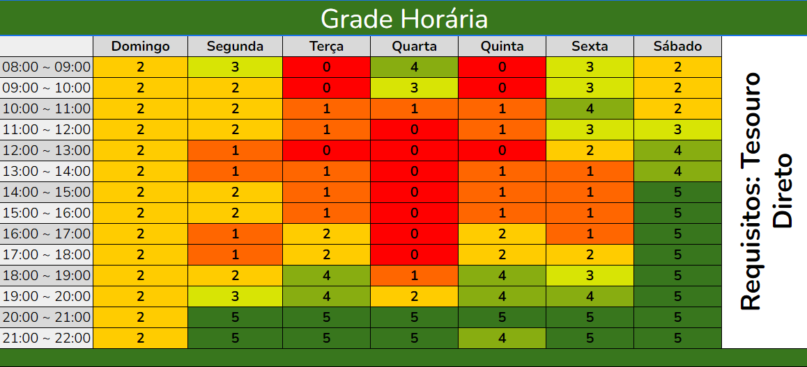

## Introdução

Para o desenvolvimento do projeto, é indispensável a reunião dos membros para encontros de planejamento e gravações de entregas. Pensando em facilitar o processo de agendamento dessas reuniões, foi elaborado o heatmap de disponibilidade dos membros.

Como representado pela Figura 1, as células com o número 0 representam 0 membros disponíveis, enquanto as células com 5 membros indicam os horários possíveis para a reunião da equipe.

##### Figura 1: Heatmap de disponibilidade do grupo 5

<b>Autor:</b> <a href="https://www.github.com/ViictorHugoo">Victor Rodrigues, 2024</a>

## Resultados

A partir da análise do heatmap preenchido pelos membros do grupo, ficaram reservados para reunião os dias de quarta-feira às 20:30 e/ou sábado às 14:00

| Versão | Data | Descrição | Autor | Revisor |
| ------ | ---------- | --------- | --------- | --------------------- |
| 1.0 | 28/10/2024 | Estruturação Inicial | [Victor Rodrigues](https://github.com/ViictorHugoo)| [Thales Euflauzino](https://github.com/thaleseuflauzino) |
| 1.1 | 31/10/2024 | Adicionando horário das reuniões | [Thales Euflauzino](https://github.com/thaleseuflauzino) |  [Víctor Schmidt](https://github.com/moonshinerd)  |
| `1.2` | 12/11/2024  | Corringindo fonte para autor | [Thales Euflauzino](https://github.com/thaleseuflauzino) | [Victor Rodrigues](https://github.com/ViictorHugoo) |
