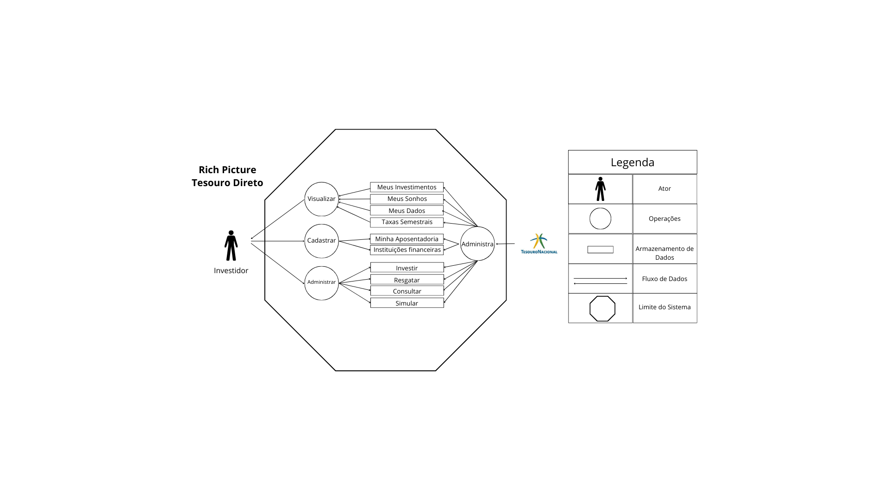

# Rich Picture

## Introdução

Rich Picture é uma ferramenta visual para expressar ideias e analisar problemas, tudo isso de forma informal e de fácil entendimento. No contexto da engenharia de software, ele é utilizado para abstrair o funcionamento de sistemas de software e se apresenta na forma de um diagrama com alguns elementos básicos como: atores, funcionalidades, armazenamento de dados, fluxo de dados e limites do sistema. <a id="TEC1" href="#RP1">1</a>

## Metodologia e Ferramentas

 A aplicação [Canva](https://www.canva.com) foi utilizada para elaborar tanto o richpicture quanto sua legenda que podem ser vistas na Figura 1 e todas as ilustrações usadas são da mesma plataforma.

Figura 1: Richpicture versão 1.

<b>Autor:</b> <a href="https://www.github.com/juliatakaki">Júlia Takaki</a>

## Referências

> <a id="RP1" href="#TEC1">1.</a> SERRANO, Maurício; SERRANO, Milene. Requisitos - Aula 4. **Aprender 3**. Distrito Federal, 2016. Disponível em: <<https://aprender3.unb.br/pluginfile.php/2972425/mod_resource/content/4/Requisitos%20-%20Aula%2004%20-%20Parte%202%20RichPicture.pdf>>. Acesso em: 28/10/2024.

## Histórico de Versões

Versão  | Data | Descrição | Autor(es) | Revisor(es)
-------- | ------ | ------ | ---------- | ----------
`1.0` | 29/10/2024 | Adição da primeira versão do richpicture  | [Júlia Takaki](https://github.com/juliatakaki) | [Thales Euflauzino](https://github.com/thaleseuflauzino)
`1.1` | 29/10/2024 | Adicionando introdução e motodologia  | [Thales Euflauzino](https://github.com/thaleseuflauzino) | 