# Questionário

## Introdução

Os questionários são ferramentas eficazes para a coleta de informações, formados por perguntas estruturadas e direcionados a um público-alvo, sejam por meios impressos ou digitais. Eles têm como objetivo reunir dados que possam subsidiar pesquisas, análises ou avaliações. No caso do Tesouro Direto, serão usados para mapear o perfil dos usuários e entender melhor suas características.

## Metodologia

Entre os dias 18 e 21 de novembro de 2024, a equipe aplicou um questionário na plataforma Google Forms, com o objetivo de levantar o perfil dos usuários do Economia DF. O questionário, composto por 15 perguntas (Figuras 1 a 14), incluindo um [termo de consentimento](../../../assets/Termo_de_Consentimento_Questionario.png), buscava coletar informações sobre as características sociodemográficas dos usuários e suas interações com o sistema. A pesquisa contou com a participação de 20 pessoas e todas o termo de consentimento.

### Questão 1 - Qual sua faixa etária?

<b>Figura 1:</b> Questão 1 do questionário de definição do perfil de usuário

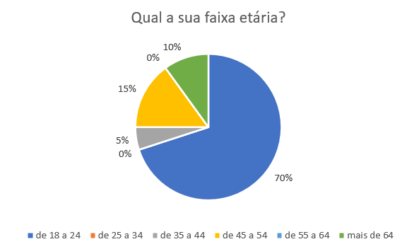

<b>Autor:</b> <a href="https://github.com/juliatakaki">Júlia Takaki</a>, 2024

### Questão 2 - Qual o seu gênero?

<b>Figura 2:</b> Questão 2 do questionário de definição do perfil de usuário

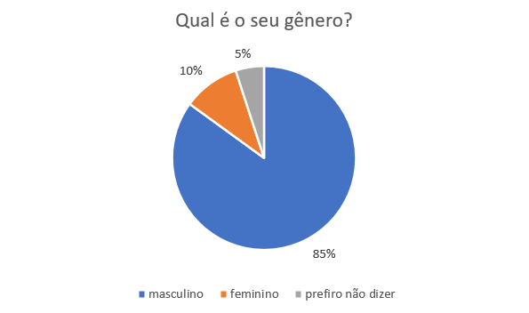

<b>Autor:</b> <a href="https://github.com/juliatakaki">Júlia Takaki</a>, 2024

### Questão 3 - Qual o seu grau de escolaridade?

<b>Figura 3:</b> - Questão 3 do questionário de definição do perfil de usuário

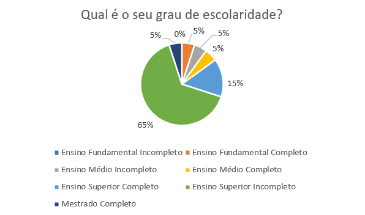

<b>Autor:</b> <a href="https://github.com/juliatakaki">Júlia Takaki</a>, 2024

### Questão 4 - Com qual técnica você se sente melhor para aprender?

<b>Figura 4:</b> - Questão 4 do questionário de definição do perfil de usuário

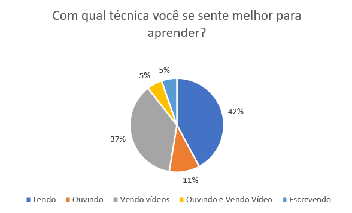

<b>Autor:</b> <a href="https://github.com/juliatakaki">Júlia Takaki</a>, 2024

### Questão 5 - Você utiliza algum aplicativo de investimentos que não seja o Tesouro Direto?

<b>Figura 5:</b> - Questão 5 do questionário de definição do perfil de usuário

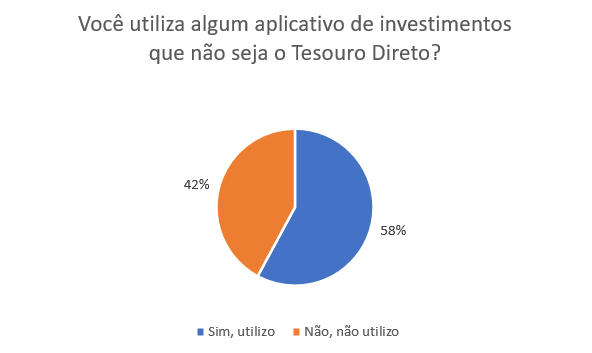

<b>Autor:</b> <a href="https://github.com/juliatakaki">Júlia Takaki</a>, 2024

### Questão 6 - Qual seu nível de intimidade com tecnologia?

<b>Figura 6:</b> - Questão 6 do questionário de definição do perfil de usuário

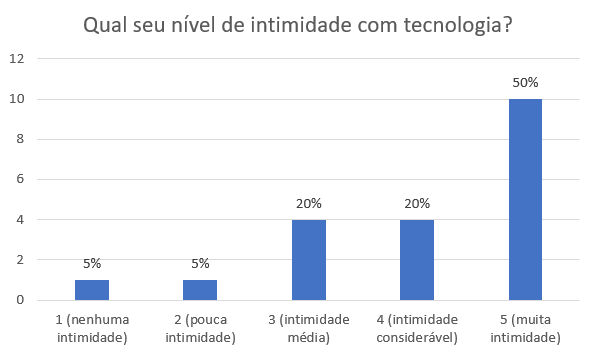

<b>Autor:</b> <a href="https://github.com/juliatakaki">Júlia Takaki</a>, 2024

### Questão 7 - Qual a sua faixa de renda mensal?

<b>Figura 7:</b> - Questão 7 do questionário de definição do perfil de usuário

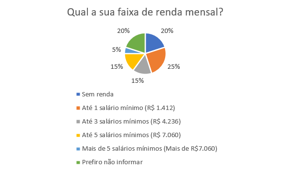

<b>Autor:</b> <a href="https://github.com/juliatakaki">Júlia Takaki</a>, 2024

### Questão 8 - Com qual frequência que você utiliza o Tesouro Direto?

<b>Figura 8:</b> - Questão 8 do questionário de definição do perfil de usuário

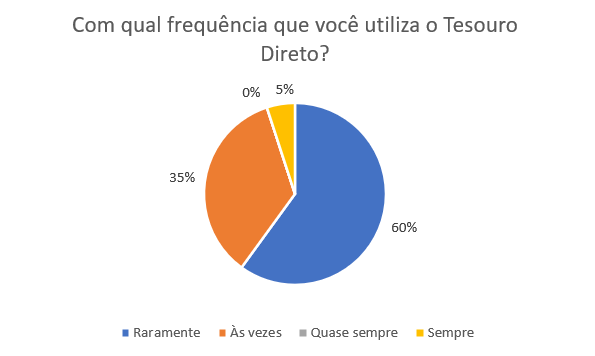

<b>Autor:</b> <a href="https://github.com/juliatakaki">Júlia Takaki</a>, 2024

### Questão 9 - Qual a sua avaliação sobre o Tesouro Direto?

<b>Figura 9:</b> - Questão 9 do questionário de definição do perfil de usuário

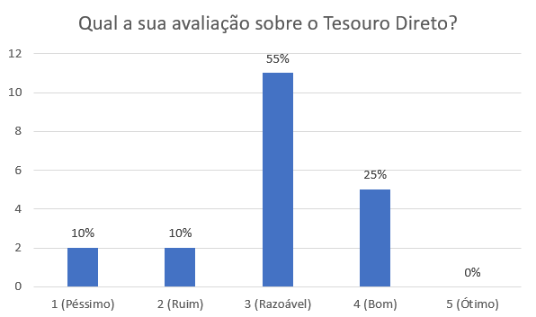

<b>Autor:</b> <a href="https://github.com/juliatakaki">Júlia Takaki</a>, 2024

### Questão 10 - Qual o seu nível de dificuldade para encontrar o que precisa no aplicativo?

<b>Figura 10:</b> - Questão 10 do questionário de definição do perfil de usuário

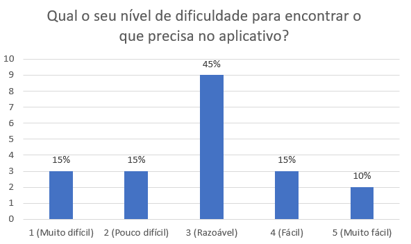

<b>Autor:</b> <a href="https://github.com/juliatakaki">Júlia Takaki</a>, 2024

### Questão 11 - Quanto a interface do Tesouro Direto é agradável para você?

<b>Figura 11:</b> - Questão 11 do questionário de definição do perfil de usuário

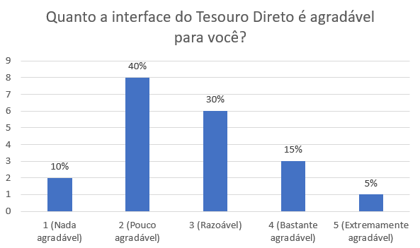

<b>Autor:</b> <a href="https://github.com/juliatakaki">Júlia Takaki</a>, 2024

### Questão 12 - Como você analisa o tempo para realizar ações dentro do Tesouro Direto?

<b>Figura 12:</b> - Questão 12 do questionário de definição do perfil de usuário

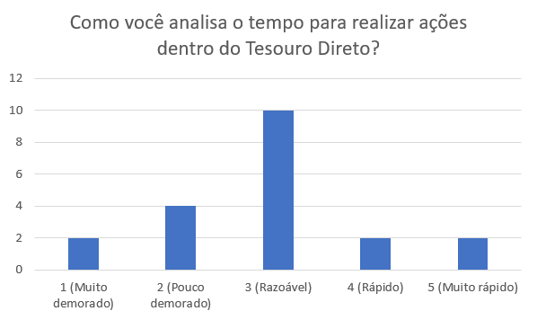

<b>Autor:</b> <a href="https://github.com/juliatakaki">Júlia Takaki</a>, 2024

### Questão 13 - Qual funcionalidade você mais utiliza?

<b>Figura 13:</b> - Questão 13 do questionário de definição do perfil de usuário

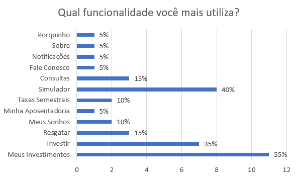

<b>Autor:</b> <a href="https://github.com/juliatakaki">Júlia Takaki</a>, 2024

### Questão 14 - Quais funcionalidades você considera mais importantes num aplicativo de investimentos?

<b>Figura 14:</b> - Questão 14 do questionário de definição do perfil de usuário

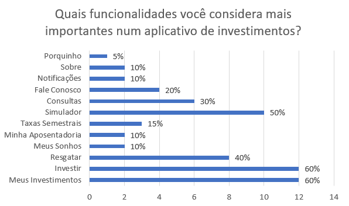

<b>Autor:</b> <a href="https://github.com/juliatakaki">Júlia Takaki</a>, 2024

## Resultados

A partir das respostas coletadas, podemos concluir que o perfil de usuário do Tesouro Direto é composto majoritariamente por homens com idade entre 18 e 24 anos. Em sua maioria possuem ensino superior incompleto e renda próxima a 1 (um) salário mínimo (R$ 1.412).

Sobre afinidade com tecnologia, podemos concluir que os usuários possuem características tecnófilas, pois em que sua maioria tem afinidade de média a alta. A respeito do uso do aplicativo, os usuários costumam usá-lo raramente e o principal objetivo é realizar a verificação dos seus investimentos. As funcionalidades "Meus Investimentos" e "Investir" foram as mais votadas como importantes dentro do aplicativo.

Acerca da avaliação geral do aplicativo, da dificuldade para encontrar funcionalidades e do tempo necessário para realizar ações no sistema, as respostas foram majoritariamente medianas. Quanto à interface, a resposta mais escolhida foi 2 (em uma escala de 1 a 5).

## Bibliografia

> BARBOSA, S. D. J.; SILVA, B. S. Interação Humano-Computador. Rio de Janeiro: Elsevier, 2011.
> ZARANZA, G. Definição do Perfil de Usuário. Repositório da disciplina de Requisitos de Software da Universidade de Brasília, 2023. Disponível em: https://requisitos-de-software.github.io/2023.2-Economia-DF/elicitacao/tecnicas-perfil-usuario/main/#introducao. Acesso em: 20 de nov. de 2024.

## Histórico de versões

| Versão | Data       | Descrição | Autor     |       Revisor         |
| ------ | ---------- | --------- | --------- | --------------------- |
| `1.0` | 20/11/2024 | Criação do documento | [Júlia Takaki](https://github.com/juliatakaki)  | [Thales Euflauzino](https://github.com/thaleseuflauzino) |
| `1.1` | 23/11/2024 | Adicionando imagens dos gráficos | [Júlia Takaki](https://github.com/juliatakaki)  | [Thales Euflauzino](https://github.com/thaleseuflauzino) |
