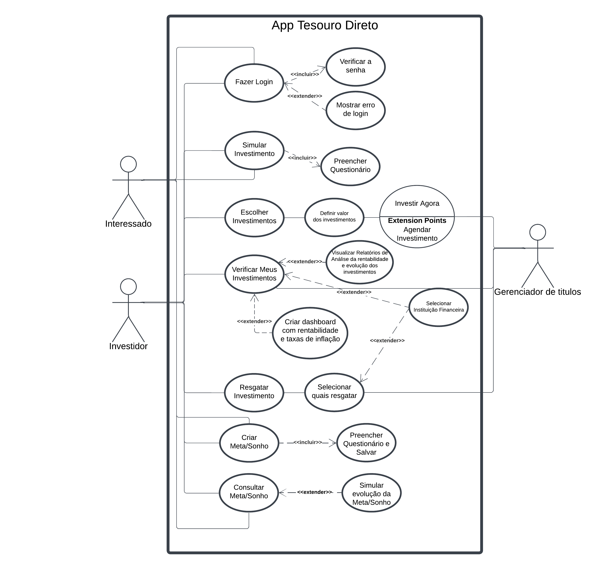

# Casos de Uso

## Introdução

Um caso de uso é uma representação detalhada de como o sistema será utilizado em um contexto ou situação específica. Ele descreve as interações entre os usuários e o sistema, destacando os passos necessários para alcançar um objetivo definido. 

Seu principal objetivo é apoiar o desenvolvimento do sistema, proporcionando uma visão clara dos requisitos funcionais. Além disso, os casos de uso especificam as ações que os usuários podem realizar e como o sistema deve responder a essas ações.

## Metodologia
O diagrama de caso de uso é uma ferramenta visual que resume as interações entre os usuários e um sistema, destacando suas funcionalidades e comportamentos principais. Ele é composto por **atores**, que representam os usuários ou outros sistemas que interagem com o sistema em questão, e **casos de uso**, que descrevem as ações realizadas pelos usuários e as respostas do sistema a essas ações.

Para criar casos de uso que atendam melhor às necessidades dos usuários, utilizamos a persona [Gustavo Ribeiro](../../elicitacao/grupo5/personas/#persona1). Essa abordagem ajuda a compreender as expectativas, desejos e desafios enfrentados pelos usuários finais do sistema. A inclusão dessa persona no processo permite modelar cenários realistas de uso, considerando as diferentes metas e necessidades do tipo de usuário que ela representa.

Voltando ao foco nos diagramas de caso de uso, a **Tabela 1** apresenta os principais elementos que compõem o diagrama, oferecendo uma visão clara e estruturada de suas partes fundamentais.

### Tabela 1: Elementos do diagrama de casos de uso

<b>Tabela 1</b>: Elementos do diagrama de casos de uso

| Nome | Função | Elemento
|------|------|:-------:
| Ator | Representam os diversos tipos de usuários externos que interagem com o sistema. | <figure style="width: 80%; display: flex; justify-content: center; background-color: white; padding: 5px;">  </figure>
| Elipse (Caso de Uso) | É utilizada para representar os casos de uso em um diagrama, destacando funcionalidades ou ações específicas que o sistema realiza em resposta às interações dos atores. A elipse identifica cada caso de uso, exibindo o nome correspondente em seu interior. | <figure style="width: 80%; display: flex; justify-content: center; background-color: white; padding: 10px;">  </figure>
| Retângulo (Sistema) | É utilizado para representar o sistema ou o componente em análise, agrupando os casos de uso e os atores associados a ele. | <figure style="width: 80%; display: flex; justify-content: center; background-color: white; padding: 10px;">  </figure>
| Flecha (Relações) | As setas são utilizadas para ilustrar as relações ou interações entre os atores e os casos de uso no diagrama. | <figure style="width: 80%; display: flex; justify-content: center; background-color: white; padding: 10px;">  </figure>

<b>Autor: <a href="https://github.com/moonshinerd">Víctor Schmidt</a></b>

Além disso, no diagrama de casos de uso, é possível detalhar:  

- **Requisitos externos do sistema**: as funcionalidades essenciais que o sistema deve fornecer para atender às demandas e expectativas dos usuários.  
- **Funcionalidades do sistema**: as capacidades que o sistema oferece para satisfazer as necessidades dos usuários de maneira eficaz e eficiente.  
- **Requisitos do sistema em relação ao ambiente**: as condições ou restrições impostas pelo sistema ao ambiente onde está inserido, especificando como ele interage com outros elementos para cumprir suas funções.  

## Diagrama de Casos de Uso

A figura 1 demonstra o diagrama de casos de uso.

Figura 1: Casos de uso do app Tesouro Direto

<b>Autor: <a href="https://github.com/moonshinerd">Víctor Schmidt</a></b>

## Especialização dos casos de uso

As tabelas de 2 a 9 mostram a especialização dos casos de uso.

### Tabela 2: Fazer Login

Tabela 2: Fazer Login 

| UC01 | Informações |
| ----- | ---------- |
| **Descrição**          | Permitir que o investidor ou interessado acesse sua conta no aplicativo.      |
| **Ator**              | Investidor ou Interessado                                                    |
| **Pré-condições**      | O aplicativo deve estar instalado e conectado à internet.   |
| **Ação**               | O Investidor ou Interessado realiza login no aplicativo.                     |
| **Fluxo principal**    | <ul><li>O Investidor ou Interessado acessa a tela inicial do app.</li><li>O Investidor ou Interessado insere suas credenciais (usuário e senha).</li><li>O sistema verifica a senha.</li><li>O Investidor ou Interessado é autenticado e acessa sua conta.</li> |
| **Fluxo alternativo**  | <ul><li>O Investidor ou Interessado acessa a tela inicial.</li><li>O sistema detecta erro de login e exibe mensagem de erro.</li></ul> |
| **Fluxo de exceção**   | <ul><li>O sistema detecta ausência de conexão com a internet.</li><li>Exibe uma mensagem informando que não é possível conectar.</li></ul> |
| **Pós-condições**      | O Investidor ou Interessado é autenticado e pode acessar as funcionalidades do aplicativo. |
| **Rastreabilidade**    | [RF33](../../elicitacao/grupo5/requisitos/#anchor_RF33) e [RF34](../../elicitacao/grupo5/requisitos/#anchor_RF34)                                                |
| **Data de Criação**    | 06/12/2024                                                 |

<b>Autor: <a href="https://github.com/moonshinerd">Víctor Schmidt</a></b>

### Tabela 3: Simular Investimento

Tabela 3: Simular Investimento 

| UC02 | Informações |
| ----- | ---------- |
| **Descrição**          | Permitir que o Investidor ou Interessado realize simulações de investimento no Tesouro Direto. |
| **Ator**              | Investidor ou Interessado                                                    |
| **Pré-condições**      | O Investidor ou Interessado deve estar autenticado no aplicativo e conectado à internet. |
| **Ação**               | O Investidor ou Interessado simula diferentes cenários de investimento.      |
| **Fluxo principal**    | <ul><li>O Investidor ou Interessado acessa a opção "Simular Investimento".</li><li>O Investidor ou Interessado preenche os dados necessários, como valor e período do investimento.</li><li>O sistema apresenta os resultados da simulação.</li></ul> |
| **Fluxo alternativo**  | <ul><li>O Investidor ou Interessado acessa "Simular Investimento".</li><li>O sistema solicita que o Investidor ou Interessado preencha um questionário para personalizar a simulação.</li><li>O questionário é preenchido, e o sistema apresenta os resultados.</li></ul> |
| **Fluxo de exceção**   | <ul><li>O sistema detecta ausência de conexão com a internet.</li><li>Exibe uma mensagem informando que não é possível realizar a simulação no momento.</li></ul> |
| **Pós-condições**      | O Investidor ou Interessado visualiza as opções de investimento com base na simulação realizada. |
| **Rastreabilidade**    | [RF02](../../elicitacao/grupo5/requisitos/#anchor_RF02)                                                  |
| **Data de Criação**    | 06/12/2024                                                 |

<b>Autor: <a href="https://github.com/moonshinerd">Víctor Schmidt</a></b>

 
### Tabela 4: Escolher Investimentos

Tabela 4: Escolher Investimentos 

| UC03 | Informações |
| ----- | ---------- |
| **Descrição**          | O Investidor escolhe o investimento mais adequado para seus objetivos. |
| **Ator**              | Investidor                                                    |
| **Pré-condições**      | O Investidor deve estar autenticado e conectado à internet.   |
| **Ação**               | O Investidor escolhe um ou mais investimentos disponíveis.    |
| **Fluxo principal**    | <ul><li>O Investidor acessa a opção "Escolher Investimentos".</li><li>O sistema apresenta a lista de investimentos disponíveis e o Investidor seleciona os que lhe interessa.</li><li>O Investidor define o valor a ser investido em cada um e escolhe investir agora ou agendar o investimento.</li></ul> |
| **Fluxo alternativo**  | <ul><li>O sistema sugere opções com base no questionário previamente preenchido.</li></ul> |
| **Fluxo de exceção**   | <ul><li>O sistema detecta problemas na conexão com o servidor.</li><li>Exibe uma mensagem informando que os investimentos não podem ser carregados no momento.</li></ul> |
| **Pós-condições**      | O Investidor realizou o investimento. |
| **Rastreabilidade**    | [RF35](../../elicitacao/grupo5/requisitos/#anchor_RF35)                                                  |
| **Data de Criação**    | 06/12/2024                                                 |

<b>Autor: <a href="https://github.com/moonshinerd">Víctor Schmidt</a></b>

### Tabela 5: Verificar Meus Investimentos

Tabela 5: Verificar Meus Investimentos 

| UC06 | Informações |
| ----- | ---------- |
| **Descrição**          | Permitir que o Investidor visualize e acompanhe os investimentos realizados. |
| **Ator**              | Investidor                                                    |
| **Pré-condições**      | O Investidor deve estar autenticado no aplicativo.            |
| **Ação**               | O Investidor verifica o histórico e status dos investimentos. |
| **Fluxo principal**    | <ul><li>O Investidor acessa "Verificar Meus Investimentos".</li><li>O sistema apresenta uma lista com os investimentos ativos e finalizados.</li></ul> |
| **Fluxo alternativo**  | <ul><li>O sistema apresenta os investimentos organizados por categoria ou instituição financeira.</li></ul> |
| **Fluxo de exceção**   | <ul><li>O sistema detecta problemas de carregamento dos dados.</li><li>Exibe uma mensagem informando que os investimentos não podem ser carregados no momento.</li></ul> |
| **Pós-condições**      | O Investidor visualiza os detalhes de seus investimentos.     |
| **Rastreabilidade**    | [RF01](../../elicitacao/grupo5/requisitos/#anchor_RF01)                                                 |
| **Data de Criação**    | 06/12/2024                                                 |

<b>Autor: <a href="https://github.com/moonshinerd">Víctor Schmidt</a></b>

### Tabela 6: Resgatar Investimento

Tabela 6: Resgatar Investimento 

| UC07 | Informações |
| ----- | ---------- |
| **Descrição**          | Permitir que o Investidor resgate investimentos realizados.   |
| **Ator**              | Investidor                                                    |
| **Pré-condições**      | O Investidor deve estar autenticado e ter investimentos disponíveis para resgate. |
| **Ação**               | O Investidor solicita o resgate de um ou mais investimentos.  |
| **Fluxo principal**    | <ul><li>O Investidor acessa "Resgatar Investimento".</li><li>O Investidor seleciona quais investimentos deseja resgatar.</li><li>O sistema confirma o resgate e processa a solicitação.</li></ul> |
| **Fluxo alternativo**  | <ul><li>O sistema solicita que o Investidor escolha a instituição financeira para crédito dos valores resgatados.</li></ul> |
| **Fluxo de exceção**   | <ul><li>O sistema detecta que o investimento selecionado não pode ser resgatado no momento.</li><li>Exibe uma mensagem com detalhes do motivo.</li></ul> |
| **Pós-condições**      | O resgate é processado e os valores são creditados na conta do Investidor. |
| **Rastreabilidade**    | [RF03](../../elicitacao/grupo5/requisitos/#anchor_RF03)                                                 |
| **Data de Criação**    | 06/12/2024                                                 |

<b>Autor: <a href="https://github.com/moonshinerd">Víctor Schmidt</a></b>

### Tabela 7: Criar Meta/Sonho

Tabela 7: Criar Meta/Sonho 

| **UC08**               | **Informações**                                                                                                      |
|-------------------------|----------------------------------------------------------------------------------------------------------------------|
| **Descrição**           | Permitir que o Investidor ou Interessado crie metas ou sonhos financeiros no sistema.                               |
| **Ator**                | Investidor ou Interessado                                                                                           |
| **Pré-condições**       | O Investidor ou Interessado deve estar autenticado no sistema.                                                      |
| **Ação**                | O Investidor ou Interessado inicia o processo de criação de uma meta ou sonho financeiro.                           |
| **Fluxo principal**     | <ul><li>1. O Investidor ou Interessado acessa a seção "Meus Sonhos".</li><li>2. O Investidor ou Interessado preenche o formulário com as seguintes informações:</li><ul><li>a. Tipo do sonho (e.g., aposentadoria, compra de casa, estudos, automóvel, reserva de emergência, férias ou outro);</li><li>b. Nome do sonho;</li><li>c. Valor total estimado para a meta (em R$);</li><li>d. Títulos selecionados para alcançar o sonho/meta.</li></ul><li>3. O Investidor ou Interessado confirma os dados inseridos.</li><li>4. O sistema processa as informações e confirma a criação da meta/sonho.</li></ul> |
| **Fluxo alternativo**   | <ul><li>1. O Investidor ou Interessado decide cancelar o processo antes de finalizar o preenchimento do formulário.</li><li>2. O sistema descarta os dados inseridos e retorna para a tela principal.</li></ul> |
| **Fluxo de exceção**    | <ul><li>1. O sistema identifica que um ou mais campos obrigatórios não foram preenchidos.</li><li>2. O sistema exibe uma mensagem de erro informando quais campos precisam ser preenchidos.</li><li>3. O Investidor ou Interessado completa os campos e tenta novamente.</li></ul> |
| **Pós-condições**       | A meta ou sonho financeiro é criado e armazenado no perfil do Investidor ou Interessado.                            |
| **Rastreabilidade**     | [RF04](../../elicitacao/grupo5/requisitos/#anchor_RF04)                                                             |
| **Data de Criação**     | 11/12/2024                                   |

<b>Autor: <a href="https://github.com/moonshinerd">Víctor Schmidt</a></b>

### Tabela 8: Simular Evolução Meta/Sonho

Tabela 8: Simular Evolução Meta/Sonho 

| **UC09**               | **Informações**                                                                                                     |
|-------------------------|---------------------------------------------------------------------------------------------------------------------|
| **Descrição**           | Permitir que o Investidor ou Interessado simule a evolução de suas metas ou sonhos financeiros no sistema.          |
| **Ator**                | Investidor ou Interessado                                                                                          |
| **Pré-condições**       | O Investidor ou Interessado deve estar autenticado no sistema.                                                     |
| **Ação**                | O Investidor ou Interessado inicia o processo de simulação da evolução de uma meta ou sonho financeiro.            |
| **Fluxo principal**     | <ul><li>1. O Investidor ou Interessado acessa a seção "Meus Sonhos".</li><li>2. O Investidor ou Interessado seleciona uma meta ou sonho financeiro existente na lista.</li><li>3. O sistema exibe os detalhes da meta, incluindo:</li><ul><li>a. Nome da meta/sonho;</li><li>b. Valor total estimado (R$);</li><li>c. Progresso atual em relação ao objetivo (percentual e valores);</li><li>d. Títulos associados ao objetivo.</li></ul><li>4. O Investidor ou Interessado insere dados de simulação, como:</li><ul><li>a. Valor adicional a ser investido;</li><li>b. Período de tempo (em meses ou anos);</li><li>c. Expectativa de retorno percentual anual.</li></ul><li>5. O sistema processa os dados e exibe uma projeção da evolução da meta, mostrando:</li><ul><li>a. Progresso esperado no período informado;</li><li>b. Gráficos ou tabelas ilustrativos;</li><li>c. Possíveis cenários (otimista, conservador, e intermediário).</li></ul><li>6. O Investidor ou Interessado avalia os resultados da simulação e, se necessário, ajusta os parâmetros ou finaliza a análise.</li></ul> |
| **Fluxo alternativo**   | <ul><li>1. O Investidor ou Interessado decide cancelar o processo de simulação antes de visualizar os resultados.</li><li>2. O sistema descarta os dados da simulação e retorna à tela principal de "Meus Sonhos".</li></ul>                  |
| **Fluxo de exceção**    | <ul><li>1. O sistema identifica que os dados inseridos para a simulação estão incompletos ou inválidos (e.g., campos em branco ou valores fora de limites plausíveis).</li><li>2. O sistema exibe uma mensagem de erro informando o problema e orienta o Investidor ou Interessado a corrigir os dados.</li><li>3. Após a correção, o sistema permite a continuação da simulação.</li></ul> |
| **Pós-condições**       | A simulação da evolução da meta ou sonho financeiro é exibida ao Investidor ou Interessado, mas não é salva no sistema (apenas descartada após análise). |
| **Rastreabilidade**     | [RF25](../../elicitacao/grupo5/requisitos/#anchor_RF25)                                                            |
| **Data de Criação**     | 11/12/2024                                                                                                         |

Esse caso de uso foi feito baseado nas [Instruções do Professor](../../elicitacao/grupo5/requisitos/#requisitos-por-integrante) sobre os requisitos a serem desenvolvidos no projeto.

<b>Autor: <a href="https://github.com/moonshinerd">Víctor Schmidt</a></b>

### Tabela 9: Relatórios Mensais de Evolução de Rendimentos

Tabela 9: Incluir Relatórios Personalizados 

| **UC10**               | **Informações**                                                                                                         |
|-------------------------|-------------------------------------------------------------------------------------------------------------------------|
| **Descrição**           | Permitir que o sistema forneça relatórios mensais com a evolução dos rendimentos dos títulos adquiridos pelo investidor.  |
| **Ator**                | Sistema                                                                                                                |
| **Pré-condições**       | O investidor deve estar autenticado no sistema.                                                                            |
| **Ação**                | O sistema gera automaticamente relatórios mensais com base nos rendimentos acumulados dos títulos do investidor.          |
| **Fluxo principal**     | <ul><li>1. O sistema coleta os dados dos rendimentos mensais dos títulos adquiridos pelo investidor.</li><li>2. O sistema processa as informações e consolida os rendimentos do mês atual e dos meses anteriores.</li><li>3. O relatório é formatado com os seguintes elementos:</li><ul><li>a. Total de rendimentos mensais por título;</li><li>b. Comparativo com meses anteriores;</li><li>c. Gráficos e/ou tabelas de evolução acumulada.</li></ul><li>4. O sistema disponibiliza o relatório na seção "Meus Relatórios".</li><li>5. O investidor pode visualizar ou fazer download do relatório.</li></ul> |
| **Fluxo alternativo**   | <ul><li>1. O investidor decide pela não geração automática dos relatórios <ul></ul><li>2. O sistema enfrenta problemas temporários ao acessar os dados de rendimentos (e.g., falhas de conectividade ou indisponibilidade do servidor).</li><li>3. O sistema exibe uma mensagem ao usuário informando a indisponibilidade momentânea e sugere tentar novamente mais tarde.</li><li>4. O usuário retorna à seção "Meus Relatórios" para acessar o relatório assim que o problema for resolvido.</li></ul> |
| **Fluxo de exceção**    | <ul><li>1. O sistema não encontra dados de rendimentos para o período solicitado.</li><li>2. O sistema exibe uma mensagem informando que não há dados suficientes para gerar o relatório.</li></ul> |
| **Pós-condições**       | O relatório mensal é gerado e armazenado para consulta futura na seção "Meus Relatórios".                              |
| **Rastreabilidade**     | [RF15](../../elicitacao/grupo5/requisitos/#anchor_RF15)                                                             |
| **Data de Criação**     | 11/12/2024                                                                                                          |

Esse caso de uso foi feito baseado nas [Instruções do Professor](../../elicitacao/grupo5/requisitos/#requisitos-por-integrante) sobre os requisitos a serem desenvolvidos no projeto.

<b>Autor: <a href="https://github.com/thaleseuflauzino">Thales Euflauzino</a></b>

### Tabela 10: Dashboard com dados de rentabilidade

Tabela 10: Dashboard de rentabilidade e inflação 

| **UC11**  | Informações |
| ----- | ---------- |
| **Descrição**          | Apresentar um dashboard com dados de rentabilidade dos títulos adquiridos e taxa de inflação. |
| **Ator**               | Investidor                                                                                  |
| **Pré-condições**      | O usuário deve estar autenticado no aplicativo e possuir títulos adquiridos em sua carteira. |
| **Ação**               | O investidor acessa o aplicativo e visualiza o dashboard inicial.                           |
| **Fluxo principal**    | <ul><li>O Investidor acessa o aplicativo Tesouro Direto.</li><li>O sistema exibe automaticamente o dashboard inicial com os dados de rentabilidade dos títulos adquiridos.</li><li>O sistema apresenta também a taxa de inflação atual e sua variação, exibida graficamente.</li><li>O investidor pode interagir com os gráficos ou selecionar intervalos de tempo para análise detalhada.</li></ul> |
| **Fluxo alternativo**  | <ul><li>O Investidor acessa o aplicativo.</li><li>O sistema detecta que o investidor não possui títulos adquiridos.</li><li>O sistema exibe uma mensagem informando que não há dados disponíveis no momento e sugere adquirir títulos.</li></ul> |
| **Fluxo de exceção**   | <ul><li>O sistema não consegue obter dados atualizados de rentabilidade ou inflação.</li><li>O sistema exibe uma mensagem informando indisponibilidade temporária e sugere tentar novamente mais tarde.</li></ul> |
| **Pós-condições**      | O investidor visualiza os dados consolidados sobre seus investimentos e pode realizar análises comparativas com a taxa de inflação. |
| **Rastreabilidade**    | [RF26](../../elicitacao/grupo5/requisitos/#anchor_RF26)                                                                                        |
| **Data de Criação**    | 12/12/2024                                                                                 |

Esse caso de uso foi feito baseado nas [Instruções do Professor](../../elicitacao/grupo5/requisitos/#requisitos-por-integrante) sobre os requisitos a serem desenvolvidos no projeto.

<b>Autor: <a href="https://github.com/ViictorHugoo">Victor Rodrigues</a></b>

## Bibliografia

> Lucidchart. Diagrama de Caso de Uso UML. Disponível em: <<https://www.lucidchart.com/pages/pt/diagrama-de-caso-de-uso-uml>>. Acesso em: 14 maio 2023.
>
> BARBOSA, S. D. J.; SILVA, B. S. Interação Humano-Computador. Rio de Janeiro: Elsevier, 2011.
>
> HENRIQUE, Paulo. Caso de Uso. Repositório da disciplina de Requisitos de Software da Universidade de Brasília, 2022. Disponível em: [https://requisitos-de-software.github.io/2022.1-Youtube/modelagem/casouso/](https://requisitos-de-software.github.io/2022.1-Youtube/modelagem/casouso/). Acesso em: 15 mai. 2023.
>
> MACEDO, Lucas. Caso de uso. Repositório da disciplina de Requisitos de Software da Universidade de Brasília, 2022. Disponível em: [https://requisitos-de-software.github.io/2022.2-Lichess/modelagem/casos_de_uso/](https://requisitos-de-software.github.io/2022.2-Lichess/modelagem/casos_de_uso/). Acesso em: 15 mai. 2023.
>
> REPOSITÓRIO DE REQUISITOS. *Modelagem - Casos de Uso*. Disponível em: <https://requisitos-de-software.github.io/2023.1-BilheteriaDigital/modelagem/useCase/>. Acesso em: 6 dez. 2024.

## Histórico de Versões

| Versão | Data       | Descrição                                      | Autor(es)                                        | Revisor(es)                                      |
| ------ | ---------- | ---------------------------------------------- | ------------------------------------------------ | ------------------------------------------------ |
| `1.0`    | 06/12/2024 | Criação da página | [Víctor Schmidt](https://github.com/moonshinerd)   | [Victor Rodrigues](https://github.com/ViictorHugoo) |
| `1.1`    | 07/12/2024 | Corrigindo Fonte para Autor | [Thales Euflauzino](https://github.com/thaleseuflauzino)   | [Víctor Schmidt](https://github.com/moonshinerd) |
| `1.2`    | 07/12/2024 | Corrigindo Fonte para Autor | [Thales Euflauzino](https://github.com/thaleseuflauzino)   | [Víctor Schmidt](https://github.com/moonshinerd) |
| `1.3`    | 10/12/2024 | Alterações e correções | [Víctor Schmidt](https://github.com/moonshinerd)   | [Thales Euflauzino](https://github.com/thaleseuflauzino) |
| `1.4`    | 11/12/2024 | Adicionando Caso de Uso baseado nas [Instruções do Professor](../../elicitacao/grupo5/requisitos/#requisitos-por-integrante)| [Víctor Schmidt](https://github.com/moonshinerd)   | [Thales Euflauzino](https://github.com/thaleseuflauzino) |
| `1.5`    | 11/12/2024 | Adicionando Caso de Uso baseado nas [Instruções do Professor](../../elicitacao/grupo5/requisitos/#requisitos-por-integrante) | [Thales Euflauzino](https://github.com/thaleseuflauzino) | [Víctor Schmidt](https://github.com/moonshinerd) |
| `1.6`    | 12/12/2024 | Adicionando Caso de Uso baseado nas [Instruções do Professor](../../elicitacao/grupo5/requisitos/#requisitos-por-integrante) | [Victor Rodrigues](https://github.com/ViictorHugoo) | |
