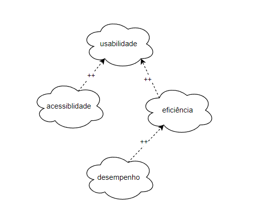
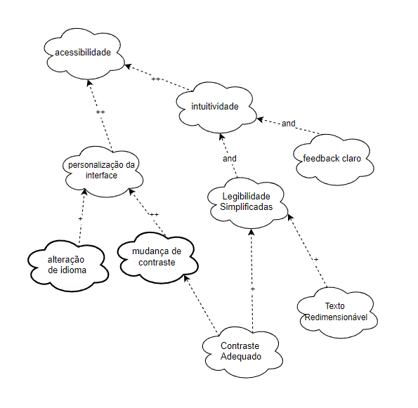
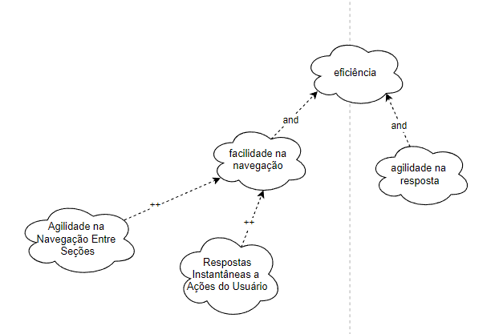
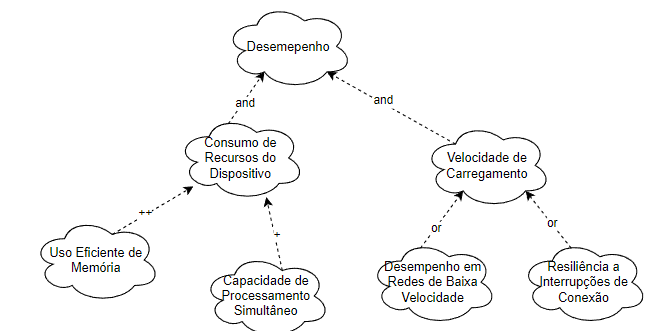

# NFR Framework

<!-- a definição do RNF e as fontes de evidência na literatura? 
Adicionar referência bibliográfica da fonte e foto do texto da referência explicando NFR
Framework.

o cartão de especificação do RNF?
Adicionar referência bibliográfica da fonte e foto do texto da referência explicando o
que é o cartão de especificação do RNF.

Os softgoals condizem com o contexto?
Adicionar referência bibliográfica da fonte e foto do texto da referência explicando o
que é softgoals.
Autor:

Softgoals representam metas bem definidas?

Os impactos foram corretamente propagados? -->

## Introdução

O NFR Framework (Non-Functional Requirements Framework) é uma abordagem desenvolvida por Lawrence Chung e colaboradores para tratar requisitos não funcionais de forma sistemática e qualitativa. Diferentemente dos requisitos funcionais, que têm critérios claros de satisfação, os requisitos não funcionais (NFRs) são subjetivos e frequentemente envolvem decisões de compromisso (trade-offs). O framework auxilia no processo de identificação, modelagem e análise desses requisitos, permitindo que desenvolvedores considerem aspectos como segurança, desempenho, usabilidade e manutenibilidade durante o design de sistemas.

 No NFR Framework, os requisitos não funcionais são representados como softgoals, que refletem objetivos flexíveis e interdependentes. Por meio de gráficos de softgoals, é possível visualizar as relações entre diferentes NFRs e como soluções propostas contribuem de forma positiva ou negativa para sua satisfação. Além disso, o framework inclui técnicas para operacionalizar os softgoals em soluções concretas e ferramentas para explorar compromissos entre requisitos conflitantes, como equilibrar desempenho e segurança. Dessa forma, o NFR Framework oferece um suporte valioso para tomada de decisões no desenvolvimento de sistemas complexos.

## Softgoal Interdependency Graph

O Softgoal Interdependency Graph (SIG) é uma ferramenta de visualização central ao funcionamento do NFR Framework. Ele apresenta de forma gráfica e estruturada os softgoals identificados pela equipe de desenvolvimento, suas inter-relações e contribuições. Esse modelo facilita a análise de interdependências entre metas não funcionais, permitindo que os desenvolvedores tomem decisões fundamentadas sobre como abordar requisitos qualitativos do sistema.

### Tipos de Softgoal

Para compreender o SIG, é essencial entender os tipos de softgoal. Um NFR Softgoal é definido como uma meta qualitativa cuja satisfação não é precisa ou completamente mensurável. Eles podem ser refinados em diferentes formas:

- Softgoals Operacionalizados: Representam transformações de metas abstratas em elementos concretos e funcionais no sistema.
- Softgoals de Afirmação: Servem como registros argumentativos em linguagem natural, adicionando justificativas ou evidências ao modelo.
Interdependências
- As interdependências entre softgoals no SIG são organizadas em dois principais conceitos: decomposições e contribuições.

#### Decomposições

As decomposições desmembram softgoals em subníveis para detalhamento e refinamento, abrangendo diferentes dimensões:

- Decomposição de NFR: Divide metas principais em componentes menores e mais gerenciáveis.
- Decomposição de Operacionalização: Foca na concretização de metas abstratas em soluções específicas.
- Decomposição de Afirmação: Valida ou rejeita justificativas específicas para softgoals.
- Decomposição de Priorização: Permite refinar metas com associação de prioridades, mantendo o mesmo escopo.

#### Contribuições

As contribuições descrevem como um softgoal derivado impacta o softgoal principal:

- AND: Todos os derivados precisam ser satisfeitos para que o objetivo principal seja alcançado.
- OR: Qualquer derivado satisfeito já contribui para alcançar o objetivo principal.
- MAKE (++): Contribuição totalmente positiva.
- BREAK (--): Contribuição totalmente negativa.
- HELP (+): Impacto positivo moderado.
- HURT (-): Impacto negativo moderado.
- UNKNOWN (?): Relação indefinida.
- EQUALS: Satisfação direta e proporcional entre derivados e principais.
- SOME: A forma de contribuição é conhecida, mas sua intensidade permanece incerta.

#### Propagação de Impactos

No NFR Framework, a propagação de impactos analisa como alterações em um softgoal afetam os demais. Isso envolve identificar relações de dependência, avaliar trade-offs e gerenciar efeitos colaterais. As notações típicas incluem:

- ✓ (satisfeito): Impacto positivo significativo.
- 𝒲+ (fracamente satisfeito): Impacto positivo, porém limitado.
- X (negado): Impacto negativo significativo.
- 𝒲- (fracamente negado): Impacto negativo menor.
- 🗲 (conflitante): Relação de conflito com características mistas.
- u (indeterminado): Impacto incerto devido à falta de dados.

## Metodologia
A construção de um SIG segue etapas sistemáticas, incluindo a definição de temas, revisão de literatura e validação. Primeiramente, os tópicos gerais são refinados para relacionar os requisitos não funcionais. Posteriormente, realiza-se a validação por meio de revisões críticas. Ferramentas como o Draw.io são utilizadas para a elaboração dos gráficos.

## Cartões de Especificação

Os cartões de especificação apresentados nas Tabelas 1 a 5 foram empregados para descrever os Requisitos Não-Funcionais destinados à elaboração dos NFR Frameworks.

<b>Tabela 1</b> - Cartão de Especificação 1
#
| <a href="anchor_RNF01">RNF01</a> | Classificação: Desempenho |
|---------------| ------------|
| Descrição: O sistema deve ter tempo de resposta inferior a 2 segundos para consultas básicas.
| Justificativa: Garantir agilidade e uma boa experiência do usuário ao utilizar funcionalidades básicas.
| Origem do Requisisto: Pesquisa de mercado e feedback de usuários.
| Critério de Aceitação: Todas as consultas básicas retornam resultados em até 2 segundos em condições normais de operação.
| Dependências: Nenhuma.
| Prioridade: 
| Conflitos: Possível aumento do uso de recursos computacionais.
| História: Adicionado após testes iniciais indicarem lentidão em consultas básicas.

Autor: [Victor Rodrigues](https://github.com/ViictorHugoo)

<b>Tabela 2</b> - Cartão de Especificação 2

| <a href="#anchor_RNF04">RNF04</a> | Classificação: Acessibilidade |
|---------------| ------------|
| Descrição: A interface do aplicativo deve seguir as diretrizes de acessibilidade da norma técnica NBR 17060:2022.
| Justificativa: Garantir que o aplicativo seja acessível a todas as pessoas, incluindo aquelas com deficiências.
| Origem do Requisisto: Regulamentações técnicas e normativas.
| Critério de Aceitação: Certificação de conformidade com a norma NBR 17060:2022 após auditoria.
| Dependências: Nenhuma 
| Prioridade: 
| Conflitos: Necessidade de ajustes adicionais na interface.
| História: Adicionado após revisão normativa.

Autor: [Víctor Schmidt](https://github.com/moonshinerd)

<b>Tabela 3</b> - Cartão de Especificação 3

| <a href="#anchor_RNF06">RNF06</a> | Classificação: Acessibilidade |
|---------------| ------------|
| Descrição: O aplicativo deverá disponibilizar suporte para múltiplos idiomas (português como padrão).
| Justificativa: Permitir que o aplicativo seja utilizado por pessoas diferentes regiões.
| Origem do Requisisto: Pesquisa de mercado global.
| Critério de Aceitação: Interface completamente traduzida para os idiomas suportados, com português como padrão.
| Dependências: Nenhuma 
| Prioridade: 
| Conflitos: Aumento de custo e tempo de desenvolvimento.
| História: Adicionado após feedback de clientes internacionais.

Autor: [Júlia Takaki](https://github.com/juliatakaki)

<b>Tabela 4</b> - Cartão de Especificação 4

| <a href="#anchor_RNF08">RNF08</a> | Classificação: Eficiência |
|---------------| ------------|
| Descrição: O perfil de recomendação de investimentos deve ser acessível a partir de 3 cliques de qualquer parte do aplicativo.
| Justificativa: Melhorar a navegação e o acesso rápido a funcionalidades importantes.
| Origem do Requisisto: Pesquisa de usabilidade.
| Critério de Aceitação: Testes de usabilidade comprovarem que o objetivo é alcançado em no máximo 3 cliques.
| Dependências: Nenhuma 
| Prioridade: 
| Conflitos: Nenhum identificado.
| História: Introduzido após feedback de usuários sobre dificuldade de navegação.

Autor: [Thales Euflauzino](https://github.com/thaleseuflauzino)

<b>Tabela 5</b> - Cartão de Especificação 5

| <a href="#anchor_RNF09">RNF09</a> | Classificação: Acessibilidade |
|---------------| ------------|
| Descrição: O aplicativo deve incluir uma opção de tema escuro para melhorar a experiência do usuário.
| Justificativa: Reduzir o cansaço visual e atender preferências dos usuários.
| Origem do Requisisto: Pesquisa de satisfação do usuário.
| Critério de Aceitação: Tema escuro implementado e acessível a partir das configurações do aplicativo.
| Dependências: Nenhuma 
| Prioridade: 
| Conflitos: Nenhum identificado.
| História: Adicionado com base em tendências de mercado.

Autor: [Maria Helena](https://github.com/MariaCHelena)

### NFR 00 - Geral

Devido à limitação para atuar exclusivamente com Requisitos Não-Funcionais ainda não implementados, o SIG apresentado foi ajustado para incorporar apenas os Requisistos a serem trabalhados, conforme ilustrado na Figura 1.

Figura 1 - SIG adaptado

Fonte: Silva, 2019

### NFR 01 - Acessibilidade

#### Requisitos Não-Funcionais - Acessibilidade

Os requisitos utilizados para a construção do SIG apresentado na Figura 2 podem ser encontrados em <a href="https://requisitos-de-software.github.io/2024.2-TesouroDireto/elicitacao/grupo5/requisitos/#anchor_RNF01">Requisitos Elicitados</a>.

- RNF04: Infere que a interface do sistema deve ser desenhada com base em diretrizes técnicas que garantam uma experiência intuitiva e eficiente para o usuário, conforme a norma NBR 17060:2022.
- RNF09: Infere que o sistema deve oferecer um tema escuro para proporcionar uma experiência personalizada e confortável, especialmente em ambientes com baixa iluminação.

Figura 2 - SIG acessibilidade

Autor: <a href="https://github.com/ViictorHugoo">Victor Rodrigues</a>, 2024

#### Propagação dos Impactos - Acessibilidade

A avaliação da propagação de impactos está apresentada na Tabela 3.

Tabela 3 - SIG acessibilidade

| NFR | Impacto |
|-----|---------|
| acessibilidade | 𝒲- |
| personalização da interface | 𝒲+ |
| alteração de idioma | X |
| mudança de contraste |𝒲+ |
| contraste adequado | 𝒲+ |
| intuitividade | ✓ |
| legibilidade simplificada | 𝒲+ |
| texto redimensionável | 𝒲- |
| feedback claro | 𝒲+ |

Autor: <a href="https://github.com/ViictorHugoo">Victor Rodrigues</a>, 2024

### NFR 02 - Eficiência

#### Requisitos Não-Funcionais - Eficiência 

Os requisitos utilizados para a construção do SIG apresentado na Figura 3 podem ser encontrados em <a href="https://requisitos-de-software.github.io/2024.2-TesouroDireto/elicitacao/grupo5/requisitos/#anchor_RNF01">Requisitos Elicitados</a>.

- RNF01: Infere que o sistema deve responder a consultas básicas em menos de 2 segundos, garantindo rapidez no processamento e na interação do usuário.
- RNF08: Infere que a navegação no aplicativo deve ser simplificada, permitindo acesso rápido ao perfil de recomendação de investimentos com um número reduzido de cliques.

Figura 3 - SIG Eficiência

 Autor: <a href="https://github.com/moonshinerd">Víctor Schmidt</a> e <a href="https://github.com/thaleseuflauzino">Thales Euflauzino</a>, 2024

#### Propagação dos Impactos - Eficiência

A avaliação da propagação de impactos está apresentada na Tabela 4.

Tabela 4 - SIG adaptado

| NFR | Impacto |
|-----|---------|
| Eficiência | 𝒲- |
| facilidade na navegação | 𝒲+ |
| Agilidade na navegação entre seções | ✓ |
| Respostas Instantâneas a Ações do Usuários | 𝒲+ |
| Agilidade nas respostas | 𝒲+ |
| Velocidade de carregamento | 𝒲+ |
| Consumo de recursos do Dispositivo | X |

 Autor: <a href="https://github.com/moonshinerd">Víctor Schmidt</a> e <a href="https://github.com/thaleseuflauzino">Thales Euflauzino</a>, 2024

### NFR 03 - Desempenho

#### Requisitos Não-Funcionais - Desempenho 

Os requisitos utilizados para a construção do SIG apresentado na Figura 4 podem ser encontrados em <a href="https://requisitos-de-software.github.io/2024.2-TesouroDireto/elicitacao/grupo5/requisitos/#anchor_RNF01">Requisitos Elicitados</a>.

- RNF01: Infere que o sistema deve ser tecnicamente otimizado para processar consultas básicas rapidamente, mesmo sob carga normal de uso.

Figura 4 - SIG Desempenho

 Autor: <a href="https://github.com/juliatakaki">Júlia Takaki</a> e <a href="https://github.com/mariachelena">Maria Helena</a>, 2024

#### Propagação dos Impactos - Desempenho

A avaliação da propagação de impactos está apresentada na Tabela 5.

Tabela 5 - SIG adaptado

| NFR | Impacto |
|-----|---------|
| Desempenho | 𝒲+ |
| Consumo de recursos do Dispositivo | 𝒲- | 
| uso eficiente da memória | 𝒲+ |
| capacidade de processamento simultâneo | ✓ |
| velocidade no carregamento | ✓ |
| Desempenho em redes de baixa velocidade | 𝒲+ |
| resiliência a interrupções de conexão | 𝒲+ |

 Autor: <a href="https://github.com/juliatakaki">Júlia Takaki</a> e <a href="https://github.com/mariachelena">Maria Helena</a>, 2024

## Bibliografia

>PAIM, F. R. S., CASTRO, J. F. B. Enhancing Data Warehouse Design with the NFR Framework. Centro de Informática UFPE, Recife, 2019. Disponível em: http://wer.inf.puc-rio.br/WERpapers/artigos/artigos_WER02/paim.pdf. Acesso em: 13/12/2024.
>
> SILVA, Reinaldo Antônio. NFR4ES: Um Catálogo de Requisitos Não-Funcionais para Sistemas Embarcados. Centro de Informática UFPE, Recife, 2019. Disponível em: https://repositorio.ufpe.br/handle/123456789/34150. Acesso em: 13/12/2024.
>
> CHUNG, L., NIXON, B. A., YU, E., MYLOPOULOS, J. Non-functional requirementsin software engineering. Springer Science & Business Media: [S.l.], 2000. v. 5.
>

## Histórico de Versões

| Versão | Data       | Descrição | Autor     |       Revisor         |
| ------ | ---------- | --------- | --------- | --------------------- |
| `1.0` | 11/12/2024  | Criação do documento | [Júlia Takaki](https://github.com/juliatakaki) | [Victor Rodrigues](https://github.com/ViictorHugoo) |
| `1.1` | 11/12/2024  | SGI e Cartões de especificação | [Victor Rodrigues](https://github.com/ViictorHugoo) | [Thales Euflauzino](https://github.com/thaleseuflauzino)|
| `1.2` | 16/12/2024  | Estrutura nfr | [Victor Rodrigues](https://github.com/ViictorHugoo) | [Victor Schmidt](https://github.com/moonshinerd) |
| `1.3` | 16/12/2024  | SGI adicionados | [Grupo](../../)  | [Victor Schmidt](https://github.com/moonshinerd) |
| `1.4` | 17/12/2024  | Ajustando fonte e autor |  [Thales Euflauzino](https://github.com/thaleseuflauzino) | [Victor Schmidt](https://github.com/moonshinerd) |
| `1.5` | 17/12/2024  | Alteração requisitada pelo professor | [Victor Rodrigues](https://github.com/ViictorHugoo) |  |
