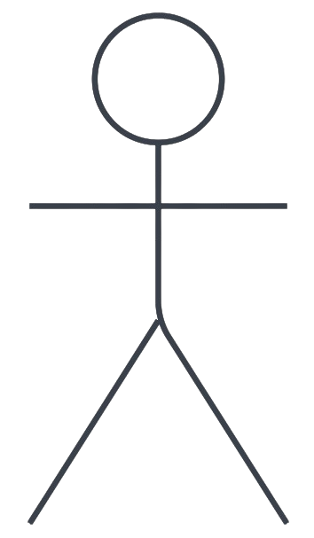
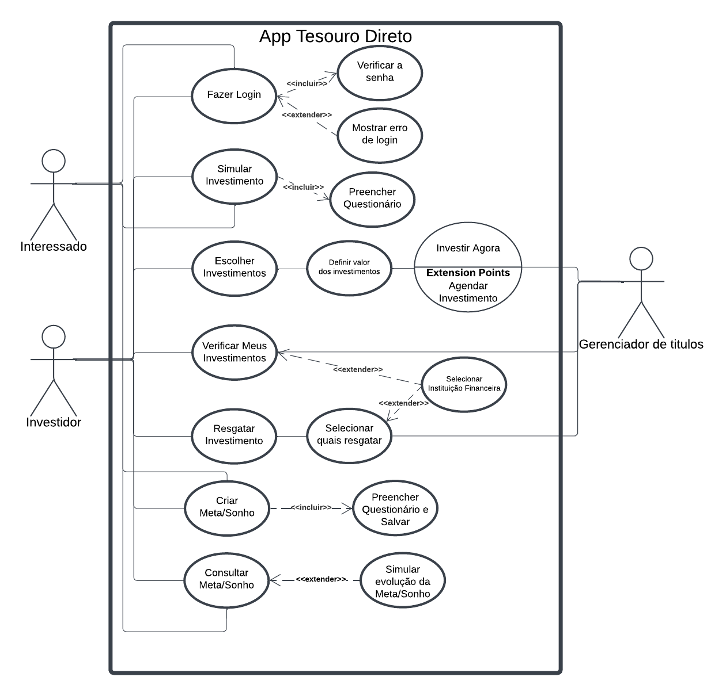

# Casos de Uso

## Introdução

Um caso de uso é uma representação detalhada de como o sistema será utilizado em um contexto ou situação específica. Ele descreve as interações entre os usuários e o sistema, destacando os passos necessários para alcançar um objetivo definido. 

Seu principal objetivo é apoiar o desenvolvimento do sistema, proporcionando uma visão clara dos requisitos funcionais. Além disso, os casos de uso especificam as ações que os usuários podem realizar e como o sistema deve responder a essas ações.

## Metodologia
O diagrama de caso de uso é uma ferramenta visual que resume as interações entre os usuários e um sistema, destacando suas funcionalidades e comportamentos principais. Ele é composto por **atores**, que representam os usuários ou outros sistemas que interagem com o sistema em questão, e **casos de uso**, que descrevem as ações realizadas pelos usuários e as respostas do sistema a essas ações.

Para criar casos de uso que atendam melhor às necessidades dos usuários, utilizamos a persona [Gustavo Ribeiro](../../elicitacao/grupo5/personas/#persona1). Essa abordagem ajuda a compreender as expectativas, desejos e desafios enfrentados pelos usuários finais do sistema. A inclusão dessa persona no processo permite modelar cenários realistas de uso, considerando as diferentes metas e necessidades do tipo de usuário que ela representa.

Voltando ao foco nos diagramas de caso de uso, a **Tabela 1** apresenta os principais elementos que compõem o diagrama, oferecendo uma visão clara e estruturada de suas partes fundamentais.

<b>Tabela 1</b>: Elementos do diagrama de casos de uso

| Nome | Função | Elemento
|------|------|:-------:
| Ator | Representam os diversos tipos de usuários externos que interagem com o sistema. | <figure style="width: 80%; display: flex; justify-content: center; background-color: white; padding: 5px;">  </figure>
| Elipse (Caso de Uso) | É utilizada para representar os casos de uso em um diagrama, destacando funcionalidades ou ações específicas que o sistema realiza em resposta às interações dos atores. A elipse identifica cada caso de uso, exibindo o nome correspondente em seu interior. | <figure style="width: 80%; display: flex; justify-content: center; background-color: white; padding: 10px;">  </figure>
| Retângulo (Sistema) | É utilizado para representar o sistema ou o componente em análise, agrupando os casos de uso e os atores associados a ele. | <figure style="width: 80%; display: flex; justify-content: center; background-color: white; padding: 10px;">  </figure>
| Flecha (Relações) | As setas são utilizadas para ilustrar as relações ou interações entre os atores e os casos de uso no diagrama. | <figure style="width: 80%; display: flex; justify-content: center; background-color: white; padding: 10px;">  </figure>

<b>Autor: <a href="https://github.com/moonshinerd">Víctor Schmidt</a></b>

Além disso, no diagrama de casos de uso, é possível detalhar:  

- **Requisitos externos do sistema**: as funcionalidades essenciais que o sistema deve fornecer para atender às demandas e expectativas dos usuários.  
- **Funcionalidades do sistema**: as capacidades que o sistema oferece para satisfazer as necessidades dos usuários de maneira eficaz e eficiente.  
- **Requisitos do sistema em relação ao ambiente**: as condições ou restrições impostas pelo sistema ao ambiente onde está inserido, especificando como ele interage com outros elementos para cumprir suas funções.  

## Diagrama de Casos de Uso

A figura 1 demonstra o diagrama de casos de uso.

Figura 1: Casos de uso do app Tesouro Direto

<b>Autor: <a href="https://github.com/moonshinerd">Víctor Schmidt</a></b>

## Especialização dos casos de uso

As tabelas de 2 a 6 mostram a especialização dos casos de uso.

Tabela 2: Fazer Login 

| UC01 | Informações |
| ----- | ---------- |
| **Descrição**          | Permitir que o usuário acesse sua conta no aplicativo.      |
| **Ator**              | Usuário                                                    |
| **Pré-condições**      | O aplicativo deve estar instalado e conectado à internet.   |
| **Ação**               | O usuário realiza login no aplicativo.                     |
| **Fluxo principal**    | <ul><li>O usuário acessa a tela inicial do app.</li><li>O usuário insere suas credenciais (usuário e senha).</li><li>O sistema verifica a senha.</li><li>O usuário é autenticado e acessa sua conta.</li> |
| **Fluxo alternativo**  | <ul><li>O usuário acessa a tela inicial.</li><li>O sistema detecta erro de login e exibe mensagem de erro.</li></ul> |
| **Fluxo de exceção**   | <ul><li>O sistema detecta ausência de conexão com a internet.</li><li>Exibe uma mensagem informando que não é possível conectar.</li></ul> |
| **Pós-condições**      | O usuário é autenticado e pode acessar as funcionalidades do aplicativo. |
| **Data de Criação**    | 06/12/2024                                                 |

<b>Autor: <a href="https://github.com/moonshinerd">Víctor Schmidt</a></b>

Tabela 3: Simular Investimento 

| UC02 | Informações |
| ----- | ---------- |
| **Descrição**          | Permitir que o usuário realize simulações de investimento no Tesouro Direto. |
| **Ator**              | Usuário                                                    |
| **Pré-condições**      | O usuário deve estar autenticado no aplicativo e conectado à internet. |
| **Ação**               | O usuário simula diferentes cenários de investimento.      |
| **Fluxo principal**    | <ul><li>O usuário acessa a opção "Simular Investimento".</li><li>O usuário preenche os dados necessários, como valor e período do investimento.</li><li>O sistema apresenta os resultados da simulação.</li></ul> |
| **Fluxo alternativo**  | <ul><li>O usuário acessa "Simular Investimento".</li><li>O sistema solicita que o usuário preencha um questionário para personalizar a simulação.</li><li>O questionário é preenchido, e o sistema apresenta os resultados.</li></ul> |
| **Fluxo de exceção**   | <ul><li>O sistema detecta ausência de conexão com a internet.</li><li>Exibe uma mensagem informando que não é possível realizar a simulação no momento.</li></ul> |
| **Pós-condições**      | O usuário visualiza as opções de investimento com base na simulação realizada. |
| **Data de Criação**    | 06/12/2024                                                 |

<b>Autor: <a href="https://github.com/moonshinerd">Víctor Schmidt</a></b>

 

Tabela 4: Escolher Investimentos 

| UC03 | Informações |
| ----- | ---------- |
| **Descrição**          | O usuário escolhe o investimento mais adequado para seus objetivos. |
| **Ator**              | Usuário                                                    |
| **Pré-condições**      | O usuário deve estar autenticado e conectado à internet.   |
| **Ação**               | O usuário escolhe um ou mais investimentos disponíveis.    |
| **Fluxo principal**    | <ul><li>O usuário acessa a opção "Escolher Investimentos".</li><li>O sistema apresenta a lista de investimentos disponíveis e o usuário seleciona os que lhe interessa.</li><li>O usuário define o valor a ser investido em cada um e escolhe investir agora ou agendar o investimento.</li></ul> |
| **Fluxo alternativo**  | <ul><li>O sistema sugere opções com base no questionário previamente preenchido.</li></ul> |
| **Fluxo de exceção**   | <ul><li>O sistema detecta problemas na conexão com o servidor.</li><li>Exibe uma mensagem informando que os investimentos não podem ser carregados no momento.</li></ul> |
| **Pós-condições**      | O usuário realizou o investimento. |
| **Data de Criação**    | 06/12/2024                                                 |

<b>Autor: <a href="https://github.com/moonshinerd">Víctor Schmidt</a></b>

Tabela 5: Verificar Meus Investimentos 

| UC06 | Informações |
| ----- | ---------- |
| **Descrição**          | Permitir que o usuário visualize e acompanhe os investimentos realizados. |
| **Ator**              | Usuário                                                    |
| **Pré-condições**      | O usuário deve estar autenticado no aplicativo.            |
| **Ação**               | O usuário verifica o histórico e status dos investimentos. |
| **Fluxo principal**    | <ul><li>O usuário acessa "Verificar Meus Investimentos".</li><li>O sistema apresenta uma lista com os investimentos ativos e finalizados.</li></ul> |
| **Fluxo alternativo**  | <ul><li>O sistema apresenta os investimentos organizados por categoria ou instituição financeira.</li></ul> |
| **Fluxo de exceção**   | <ul><li>O sistema detecta problemas de carregamento dos dados.</li><li>Exibe uma mensagem informando que os investimentos não podem ser carregados no momento.</li></ul> |
| **Pós-condições**      | O usuário visualiza os detalhes de seus investimentos.     |
| **Data de Criação**    | 06/12/2024                                                 |

<b>Autor: <a href="https://github.com/moonshinerd">Víctor Schmidt</a></b>

Tabela 6: Resgatar Investimento 

| UC07 | Informações |
| ----- | ---------- |
| **Descrição**          | Permitir que o usuário resgate investimentos realizados.   |
| **Ator**              | Usuário                                                    |
| **Pré-condições**      | O usuário deve estar autenticado e ter investimentos disponíveis para resgate. |
| **Ação**               | O usuário solicita o resgate de um ou mais investimentos.  |
| **Fluxo principal**    | <ul><li>O usuário acessa "Resgatar Investimento".</li><li>O usuário seleciona quais investimentos deseja resgatar.</li><li>O sistema confirma o resgate e processa a solicitação.</li></ul> |
| **Fluxo alternativo**  | <ul><li>O sistema solicita que o usuário escolha a instituição financeira para crédito dos valores resgatados.</li></ul> |
| **Fluxo de exceção**   | <ul><li>O sistema detecta que o investimento selecionado não pode ser resgatado no momento.</li><li>Exibe uma mensagem com detalhes do motivo.</li></ul> |
| **Pós-condições**      | O resgate é processado e os valores são creditados na conta do usuário. |
| **Data de Criação**    | 06/12/2024                                                 |

<b>Autor: <a href="https://github.com/moonshinerd">Víctor Schmidt</a></b>

## Bibliografia

> Lucidchart. Diagrama de Caso de Uso UML. Disponível em: <<https://www.lucidchart.com/pages/pt/diagrama-de-caso-de-uso-uml>>. Acesso em: 14 maio 2023.

> BARBOSA, S. D. J.; SILVA, B. S. Interação Humano-Computador. Rio de Janeiro: Elsevier, 2011.

> HENRIQUE, Paulo. Caso de Uso. Repositório da disciplina de Requisitos de Software da Universidade de Brasília, 2022. Disponível em: [https://requisitos-de-software.github.io/2022.1-Youtube/modelagem/casouso/](https://requisitos-de-software.github.io/2022.1-Youtube/modelagem/casouso/). Acesso em: 15 mai. 2023.

> MACEDO, Lucas. Caso de uso. Repositório da disciplina de Requisitos de Software da Universidade de Brasília, 2022. Disponível em: [https://requisitos-de-software.github.io/2022.2-Lichess/modelagem/casos_de_uso/](https://requisitos-de-software.github.io/2022.2-Lichess/modelagem/casos_de_uso/). Acesso em: 15 mai. 2023.

> REPOSITÓRIO DE REQUISITOS. *Modelagem - Casos de Uso*. Disponível em: <https://requisitos-de-software.github.io/2023.1-BilheteriaDigital/modelagem/useCase/>. Acesso em: 6 dez. 2024.

## Histórico de Versões

| Versão | Data       | Descrição                                      | Autor(es)                                        | Revisor(es)                                      |
| ------ | ---------- | ---------------------------------------------- | ------------------------------------------------ | ------------------------------------------------ |
| `1.0`    | 06/12/2024 | Criação da página | [Víctor Schmidt](https://github.com/moonshinerd)   | [Victor Rodrigues](https://github.com/ViictorHugoo) |
| `1.1`    | 07/12/2024 | Corrigindo Fonte para Autor | [Thales Euflauzino](https://github.com/thaleseuflauzino)   | [Víctor Schmidt](https://github.com/moonshinerd) |
