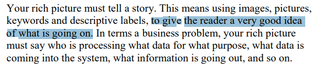
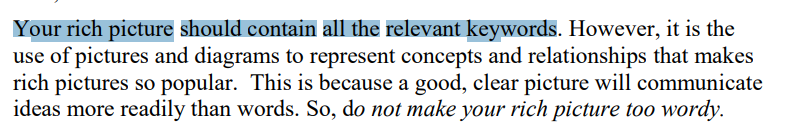
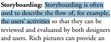
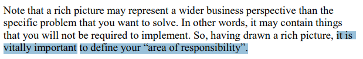

# Planejamento da Verificação da Etapa 1 do Grupo

## Introdução

O artefato visa apresentar o planejamento para a verificação de cada artefato da etapa 1 do projeto do [grupo](https://github.com/Requisitos-de-Software/2024.2-TesouroDireto).

## Objetivos

O objetivo deste documento é verificar se os artefatos produzidos para entrega 1 do [grupo](https://github.com/Requisitos-de-Software/2024.2-TesouroDireto) possuem os itens e o padrão exigidos. É importante citar que essa verificação em momento nenhum busca diminuir os membros responsáveis seu trabalho, apenas aplicar os conceitos de verificação.

## Metodologia

A metodologia escolhida para esta verificação é uma adaptação da inspeção. Desenvolvida originalmente para códigos de software por Fagan na IBM em 1976, essa técnica consiste em uma revisão formal dos artefatos produzidos a fim de se encontrar defeitos, a figura 1 exemplifica as etapas que Fagan propôs para esse processo.

**Figura 1** - Etapas da Inspeção de acordo com Fagan.

_Fonte: SOMMERVILLE (2007)._<a id="anchor_4" href="#REF4">4</a>

### Objetos da Verificação

Os artefatos alvos dessa verificação são:

- [Heatmap](../../../Planejamento-do-projeto/heatmap.md) na versão 1.1 de data 31/10/2024, produzido por [Victor Rodrigues](https://github.com/ViictorHugoo) e [Thales Euflauzino](https://github.com/thaleseuflauzino) com revisão de [Thales Euflauzino](https://github.com/thaleseuflauzino) e [Víctor Schmidt](https://github.com/moonshinerd).
- [Lista de apps avaliados](../../../Planejamento-do-projeto/lista-apps-avaliados.md) na versão 1.5 de data 31/10/2024, produzido por e revisado por todos os membros do grupo.
- [App Escolhido](../../../Planejamento-do-projeto/app-escolhido.md) na versão 1.3 de data 29/10/2024, produzido por [Victor Rodrigues](https://github.com/ViictorHugoo) e [Júlia Takaki](https://github.com/juliatakaki) com revisão de [Thales Euflauzino](https://github.com/thaleseuflauzino) e [Víctor Schmidt](https://github.com/moonshinerd)
- [Rich Picture](../../../Planejamento-do-projeto/rich-picture.md) na versão 1.1 de data 02/11/2024, produzido por [Thales Euflauzino](https://github.com/thaleseuflauzino) e [Júlia Takaki](https://github.com/juliatakaki) com a revisão de [Víctor Schmidt](https://github.com/moonshinerd).
- [Cronograma](../../../Planejamento-do-projeto/cronograma.md) na versão 1.3 de data 02/11/2024, produzido por [Maria Helena](https://github.com/MariaCHelena) e [Víctor Schmidt](https://github.com/moonshinerd) com revisão de [Thales Euflauzino](https://github.com/thaleseuflauzino).

### Resultados das Verificações

Os resultados das verificações podem ser acessados através do seguinte link:

- [Relatório da Verificação](./relatorio-verificacao-e1-gp5.md);

### Cronograma

A verificação será realizada no período de 06 de novembro de 2024, com os resultados sendo relatados através da página de documentação do Grupo 5 no dia 06 de novembro de 2024. A tabela 2 a seguir, apresenta o cronograma das atividades a serem realizadas.

**Tabela 2** - Cronograma das Atividades.

| Data       | Descrição                    | Responsável                                 |
| ---------- | ---------------------------- | ------------------------------------------- |
| 30/10/2024 | Verificação do Rich Picture. | [Thales Euflauzino](https://github.com/thaleseuflauzino) e [Víctor Schmidt](https://github.com/moonshinerd) |
| 02/11/2024 | Adição dos resultados.       | [Víctor Schmidt](https://github.com/moonshinerd) e [Victor Rodrigues](https://github.com/ViictorHugoo)     |

_Autor: [Víctor Schmidt](https://github.com/moonshinerd), 2024_

## Lista de Verificação

As listas de verificação foram construídas levando em conta os padrões esperados para cada artefato e as principais tarefas realizadas na elaboração dos mesmos, tudo isso de acordo com os slides da _Aula 04 da professora Milene e Maurício Serrano_<a id=anchor_3 href="#REF3">3</a> e a literatura _Introducing Rich Picture - Rich Picture Drawing Guidelines_<a id=anchor_2 href="#REF2">2</a>.

Com o intuito de melhor organizar a verificação, a lista de verificação será dividida em 2 listas sendo que uma deverá estar presente em todas as etapas de verificação, no caso a Lista de Verificação Geral. Sendo assim, as listas de verificação serão as seguintes: Geral e Rich Picture. As tabelas de 3 a 4 apresenta as listas de verificação utilizadas na verificação.

### Geral

**Tabela 3** - Lista de Verificação dos Itens do Planejamento Geral do projeto .

|        ID        | Descrição                                                                                                           | Avaliação  |
| :--------------: | ------------------------------------------------------------------------------------------------------------------- | :--------: | 
|        1         | Uma página apresentando os integrantes da equipe (com foto) com nome e sem matrícula?                                                                                       |    ---     |
|        2         | o cronograma do planejamento apresenta todas as atividades de todas as etapas para cada integrante com as datas de início e fim das entrega dos artefatos e com o período da revisão deles?                                                       |    ---     |
|        3         | o cronograma do planejamento apresenta um período de gravação da apresentação de cada etapa              |    ---     |
|        4         | O cronograma prever um período de revisão/ajustes nos artefatos devidos as considerações dos monitores/professor?                                        |    ---     |
|        5         | A motivação e os critérios para a escolha do App?                                                                              |    ---     |
|        6         | Cópia do Termo de Uso, Direito de Uso ou Propriedade Intelectual do aplicativo permitindo o estudo na disciplina.                                                                              |    ---     |
|        7         | Possui opção de contraste de cores?                                                                              |    ---     |

_Autores: Equipe do Projeto, 2024._

### Rich Picture

O **Rich Picture** para o Tesouro Direto foi criado pela [Julia Takaki](https://github.com/juliatakaki) e ajudou a equipe a visualizar os processos e os principais pontos do projeto de maneira clara e direta. Já a lista de verificação foi desenvolvida por todos os membros, reunindo as contribuições e perspectivas de cada um. Esse trabalho colaborativo garantiu que todas as etapas fossem cuidadosamente planejadas e acompanhadas, facilitando a organização e permitindo que o grupo mantivesse o foco nos objetivos do projeto.

**Tabela 4** - Lista para a Verificação do Rich Picture.

|        ID        | Descrição                                                                                                           | Avaliação  |
| :--------------: | ------------------------------------------------------------------------------------------------------------------- | :--------: | 
|<a id="REF5" href="#anchor_5">1</a>| O Rich Picture conta uma história clara e compreensível?   **Autor: Thales Euflauzino**                                                                              |    ---     |
|        <a id="REF6" href="#anchor_6">2</a>        | O fluxo de dados está claro? quem está processando qual dado e para qual propósito, por exemplo   **Autor: Victor Guimarães**                                                                               |    ---     |
|        <a id="REF7" href="#anchor_7">3</a>        | O Rich Picture tem todas as palavras chaves necessárias do projeto?        **Autor: Víctor Schmidt**                                                                         |    ---     |
|        <a id="REF8" href="#anchor_8">4</a>        | O Rich Picture utiliza um storyboard para descrever o fluxo de, por exemplo, atividades dos usuários?          **Autor: Julia Takaki**                                                                       |    ---     |
|        <a id="REF9" href="#anchor_9">5</a>        | O Rich Picture contém uma representação visual clara da delimitação do sistema, ou seja, da sua "área de responsabilidade"?   **Autor: Maria Helena**                                                                                                       |    ---     |

_Autores: [Victor Schmidt](https://github.com/moonshinerd) e [Thales Euflauzino](https://github.com/thaleseuflauzino), 2024._

## Bibliografia

> REQUISTOS DE SOFTWARE. Planejamento da Verificação da Etapa 1 do Grupo 2. Disponível em: https://requisitos-de-software.github.io/2023.1-BilheteriaDigital/verificacao/grupo2/entrega1/planejamento-verificacao-e1-grupo2/. Acesso em: 2 nov. 2024.
>****
> <a id="REF2" href="#anchor_2">2.</a> REVADI, Chindy Elsanna. Introducing Rich Pictures - Rich Picture Drawing Guidelines. Disponível em: [https://aprender3.unb.br/pluginfile.php/2523045/mod_resource/content/2/1_5145791542719414573.pdf](https://aprender3.unb.br/pluginfile.php/2523045/mod_resource/content/2/1_5145791542719414573.pdf). Acessado em: 02 de novembro de 2024.
>****
> <a id="REF3" href="#anchor_3">3.</a> SERRANO, MAURÍCIO; SERRANO, Milene. **Slides da aula Requisitos – Aula 04**. Disponível em: [https://aprender3.unb.br/pluginfile.php/2523041/mod_resource/content/3/Requisitos%20-%20Aula%2004.pdf](https://aprender3.unb.br/pluginfile.php/2523041/mod_resource/content/3/Requisitos%20-%20Aula%2004.pdf). Acessado em: 02 de novembro de 2024.
>****
> <a id="REF4" href="#anchor_4">4.</a> SOMMERVILLE, Ian. **Engenharia de software.** 08. ed. São Paulo: Pearson Addison Wesley, 2007
>****
><a id="anchor_5" href="#REF5">5</a> 
>****
><a id="anchor_6" href="#REF6">6</a> 
>****
><a id="anchor_7" href="#REF7">7</a> 
>****
> <a id="anchor_8" href="#REF8">8</a> 
>****
> <a id="anchor_9" href="#REF9">9</a> 

## Histórico de Versões

| Versão  | Data | Descrição | Autor(es) | Revisor(es) |
| -------- | ------ | ------ | ---------- | ---------- |
| `1.0` | 02/11/2024 | Criação do documento  | [Víctor Schmidt](https://github.com/moonshinerd) e [Victor Rodrigues](https://github.com/ViictorHugoo) | [Thales Euflauzino](https://github.com/thaleseuflauzino) |
| `1.1` | 12/11/2024  | Corringindo checklist para lista de verificação | [Thales Euflauzino](https://github.com/thaleseuflauzino) | [Victor Rodrigues](https://github.com/ViictorHugoo) |
| `1.2` | 12/11/2024  | Corringindo fonte para autor | [Thales Euflauzino](https://github.com/thaleseuflauzino) | [Victor Rodrigues](https://github.com/ViictorHugoo) |
