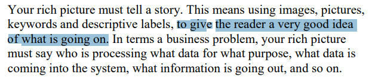

# Verificação dos artefatos

## Introdução

Após o planejamento, realiza-se a inspeção dos artefatos. Este documento apresenta os objetivos da verificação, a metodologia utilizada e a lista de verificação para a avaliação. Além disso, os problemas encontrados poderão conter observações e serão sumarizados e analisados, fornecendo informações valiosas para auxiliar na sua correção.

## Objetivo

O objetivo deste documento é relatar os resultados das verificações realizadas acerca dos artefatos produzidos pelo [grupo](https://github.com/Requisitos-de-Software/2024.2-TesouroDireto)

## Metodologia

Os resultados da verificação do artefato foram obtidos a partir da lista de verificação elaborada na página de [planejamento](../entrega1/planej-verificacao-e1-gp5.md) Para responder às perguntas apresentadas na lista de verificação, o avaliador usará as opções **Sim**, **Não** ou **Incompleto**. O avaliador poderá, também, escrever observações em cada pergunta, detalhando pontos que achar necessários.

### Cronograma e Participantes

Os participantes da verificação são integrantes do grupo. [Thales Euflauzino](https://github.com/thaleseuflauzino), que irá verificar e corrigir possíveis problemas. E o integrante do grupo [Víctor Schmidt](https://github.com/moonshinerd) realizará a revisão da avaliação realizada. Em relação ao cronograma seguido, ele já foi explicitado na página de [planejamento](../entrega1/planej-verificacao-e1-gp5.md).

**Tabela 1** - Lista de Verificação.

|        ID        | Descrição                                                                                                           | Avaliação  | Autor        | Data e hora |
| :--------------: | ------------------------------------------------------------------------------------------------------------------- | :--------: | ------------ | ------------- |
| **Itens do Planejamento Geral do projeto** |                                                                                                                     |            |              |               |
|        1         | Uma página apresentando os integrantes da equipe (com foto) com nome e sem matrícula?                                                                                       |    Sim     | André Barros |      06/11/2024 21:20          |
|        2         | O cronograma do planejamento apresenta todas as atividades de todas as etapas para cada integrante com as datas de início e fim das entrega dos artefatos e com o período da revisão deles?                                                       |    Sim     | André Barros |      06/11/2024 21:20         |
|        3         | O cronograma do planejamento apresenta um período de gravação da apresentação de cada etapa              |    Sim     | André Barros |       06/11/2024 21:20         |
|        4         | O cronograma prever um período de revisão/ajustes nos artefatos devidos as considerações dos monitores/professor?                                        | Incompleto | André Barros |      06/11/2024 21:20          |
|        5         | A motivação e os critérios para a escolha do App?                                                                              |    Sim     | André Barros |        06/11/2024 21:20        |
|        6         | Cópia do Termo de Uso, Direito de Uso ou Propriedade Intelectual do aplicativo permitindo o estudo na disciplina.                                                                              |    Sim     | André Barros |       06/11/2024 21:20         |
|        7         | Possui opção de contraste de cores?                                                                              |    Sim     | André Barros |    06/11/2024 21:20            |
| **Itens do Desenvolvimento do projeto** |                                                                                                                     |            |              |               |
|        1         | O histórico de versão padronizado?                       |    Sim     | André Barros |         06/11/2024 21:20       |
|        2         | O(s) autor(es) e o(s) revisor(es) para cada artefato? | Sim | André Barros |     06/11/2024 21:20           |
|        3         | Referências bibliográficas e/ou bibliografia em todos os artefatos?                                                                                            |    Sim     | André Barros |    06/11/2024 21:20            |
|        4         | As tabelas e imagens possuem legenda e fonte e elas chamadas dentro dos texto?                                              |    Sim     | André Barros |        06/11/2024 21:20        |
|        5         | Um texto fazendo uma introdução dos artefatos?                                                                                             |    Sim     | André Barros |    06/11/2024 21:20            |
|        6         | O cronograma executado com quem realizou cada artefato/atividade com as datas de início e fim da construção/realização do artefato/atividade.    |    Sim     | André Barros |      06/11/2024 21:20          |
|        7         | Ata(s) da(s) reuniões (com data, horário de início e do final, participantes, objetivo, atividades definidas etc).                                                      |    Sim     | André Barros |        06/11/2024 21:20        |
|        8         | A gravação da reunião do grupo.                                                                                   |    Sim     | André Barros |       06/11/2024 21:20         |
|        9         | Vídeo de apresentação na categoria “não listado” no youtube?                                                                               |    Sim     | André Barros |      06/11/2024 21:20          |
| **Itens do Conteúdo da Disciplina** (a foto referente ao texto está no ID) |                                                                                                                     |            |              |               |
|        <a id="REF1" href="#anchor_1">1</a>        | O Rich Picture conta uma história clara e compreensível?                                                                             |    Sim     | Thales Euflauzino |  06/11/2024 21:20       |
|        <a id="REF2" href="#anchor_2">2</a>        | O fluxo de dados está claro? quem está processando qual dado e para qual propósito, por exemplo                                                                               |    Sim     | Victor Guimarães |      06/11/2024 21:20          |
|        <a id="REF3" href="#anchor_3">3</a>        | O Rich Picture tem todas as palavras chaves necessárias do projeto?                                                                            |    Sim     | Víctor Schmidt |      06/11/2024 21:20          |
|        <a id="REF4" href="#anchor_4">4</a>        | O Rich Picture utiliza um storyboard para descrever o fluxo de, por exemplo, atividades dos usuários?                                                                     |    Sim     | Julia Takaki |      06/11/2024 21:20          |
|        <a id="REF5" href="#anchor_5">5</a>        | O Rich Picture contém uma representação visual clara da delimitação do sistema, ou seja, da sua "área de responsabilidade"?                                                                                                   |    Sim     | Maria Helena |       06/11/2024 21:20         |

Autor: [Thales Euflauzino](https://github.com/thaleseuflauzino) 2024._

## Vídeo da Verificação

[**Vídeo 1:** Requisitos - Verificação Entrega 1](https://www.youtube.com/watch?v=fnsxUFg5hi4)
<iframe width="560" height="315" src="https://www.youtube.com/embed/JUBg_qbl4IQ" title="YouTube video player" frameborder="0" allow="accelerometer; autoplay; clipboard-write; encrypted-media; gyroscope; picture-in-picture" allowfullscreen></iframe>
Autor: [Víctor Schmidt](https://github.com/moonshinerd)_

---
## Bibliografia

> SALES, André Barros. Plano de Ensino. Aprender 3. Distrito Federal, 2024. Disponível em: [https://aprender3.unb.br/pluginfile.php/2972367/mod_resource/content/51/Plano_de_Ensino%20RE%20022024%20Turma%2002%20v1.pdf](https://aprender3.unb.br/pluginfile.php/2972367/mod_resource/content/51/Plano_de_Ensino%20RE%20022024%20Turma%2002%20v1.pdf). Acesso em 28 out. 2024.
>
> CTEC2402 - Software Development Project **Introducing Rich Pictures - Rich Picture Drawing Guidelines.**. Acesso em: 28 out. 2024
>
> Verificação - Bilheteria Digital. Disponível em: <https://requisitos-de-software.github.io/2023.1-BilheteriaDigital/verificacao/grupo/entrega1/verificacao-rich-picture//>. Acesso em 02 de novembro de 2024.
>
><a id="anchor_1" href="#REF1">1</a> 
>****
><a id="anchor_2" href="#REF2">2</a> 
>****
><a id="anchor_3" href="#REF3">3</a> 
>****
> <a id="anchor_4" href="#REF4">4</a> 
>****
> <a id="anchor_5" href="#REF5">5</a> 

## Histórico de Versões

| Versão  | Data | Descrição | Autor(es) | Revisor(es) |
| -------- | ------ | ------ | ---------- | ---------- |
| `1.0` | 02/11/2024 | Criação do documento  | [Thales Euflauzino](https://github.com/thaleseuflauzino) | [Víctor Schmidt](https://github.com/moonshinerd) |
| `1.1` | 02/11/2024 | Adicionando revisão da Rich Picture | [Thales Euflauzino](https://github.com/thaleseuflauzino) | [Víctor Schmidt](https://github.com/moonshinerd) |
| `1.2` | 06/11/2024 | Mudando avaliação do cronograma | [Víctor Rodrigues](https://github.com/ViictorHugoo) | [Julia Takaki](https://github.com/juliatakaki) |
| `1.3` | 06/11/2024 | Adicionando vídeo de verificação ao relatorio | [Víctor Schmidt](https://github.com/moonshinerd) | [Maria Helena](https://github.com/MariaCHelena) |
| `1.4` | 12/11/2024  | Corringindo checklist para lista de verificação | [Thales Euflauzino](https://github.com/thaleseuflauzino) | [Victor Rodrigues](https://github.com/ViictorHugoo) |
| `1.5` | 12/11/2024  | Adicionando autor e data na tabela de verificação | [Thales Euflauzino](https://github.com/thaleseuflauzino) | [Victor Rodrigues](https://github.com/ViictorHugoo) |
| `1.6` | 12/11/2024  | Corringindo fonte para autor | [Thales Euflauzino](https://github.com/thaleseuflauzino) | [Victor Rodrigues](https://github.com/ViictorHugoo) |
