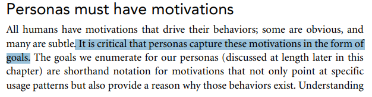
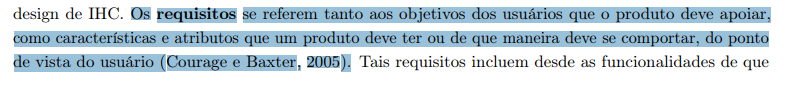

# Planejamento da Verificação da Etapa 2 do Grupo

## Introdução

O artefato visa apresentar o planejamento para a verificação de cada artefato da etapa 2 do projeto (Elicitação de Requisitos) do [grupo](https://github.com/Requisitos-de-Software/2024.2-TesouroDireto).

## Objetivos

O objetivo deste documento é verificar se os artefatos produzidos para entrega 2 do [grupo](https://github.com/Requisitos-de-Software/2024.2-TesouroDireto) possuem os itens e o padrão exigidos. É importante citar que essa verificação em momento nenhum busca diminuir os membros responsáveis seu trabalho, apenas aplicar os conceitos de verificação.

## Metodologia

A metodologia escolhida para esta verificação é uma adaptação da inspeção. Desenvolvida originalmente para códigos de software por Fagan na IBM em 1976, essa técnica consiste em uma revisão formal dos artefatos produzidos a fim de se encontrar defeitos, a figura 1 exemplifica as etapas que Fagan propôs para esse processo.

**Figura 1** - Etapas da Inspeção de acordo com Fagan.

_Fonte: SOMMERVILLE (2007)._ <a id="anchor_7" href="#REF7">1</a>

### Objetos da Verificação

Os artefatos alvos dessa verificação são:

- [Brainstorm](../../../elicitacao/grupo5/brainstorm.md) na versão 1.4 de data 20/11/2024, produzido por [Victor Schmidt](https://github.com/moonshinerd) com revisão de [Thales Euflauzino](https://github.com/thaleseuflauzino) e [Maria Helena](https://github.com/MariaCHelena).
- [Grupo de Foco](../../../elicitacao/grupo5/grupo-de-foco.md) na versão 1.1 de data 21/11/2024, produzido por [Thales Euflauzino](https://github.com/thaleseuflauzino) e revisado por [Victor Rodrigues](https://github.com/ViictorHugoo).
- [Introspecção](../../../elicitacao/grupo5/introspeccao.md) na versão 1.0 de data 15/11/2024, produzido por [Víctor Schmidt](https://github.com/moonshinerd) com revisão de [Thales Euflauzino](https://github.com/thaleseuflauzino).
- [Personas](../../../elicitacao/grupo5/personas.md) na versão 1.0 de data 19/11/2024, produzido por [Víctor Rodrigues](https://github.com/ViictorHugoo) com revisão de [Thales Euflauzino](https://github.com/thaleseuflauzino).
- [Glossário](../../../elicitacao/grupo5/glossario.md) na versão 1.1 de data 21/11/2024, produzido por [Thales Euflauzino](https://github.com/thaleseuflauzino) com revisão de [Víctor Rodrigues](https://github.com/ViictorHugoo).
- [Priorização 100$](../../../elicitacao/grupo5/priorizacao/100$.md) na versão 1.2 de data 22/11/2024, produzido por [Víctor Rodrigues](https://github.com/ViictorHugoo) com revisão de [Thales Euflauzino](https://github.com/thaleseuflauzino).
- [Priorização In or Out](../../../elicitacao/grupo5/priorizacao/inorout.md) na versão 1.2 de data 22/11/2024, produzido por [Víctor Rodrigues](https://github.com/ViictorHugoo) com revisão de [Thales Euflauzino](https://github.com/thaleseuflauzino).
- [Priorização Three Level Scale](../../../elicitacao/grupo5/priorizacao/threelevelscale.md) na versão 1.2 de data 22/11/2024, produzido por [Víctor Rodrigues](https://github.com/ViictorHugoo) com revisão de [Thales Euflauzino](https://github.com/thaleseuflauzino).
- [Perfil de Usuário](../../../elicitacao/grupo5/definicao-perfil_de_usuario/perfil-usuario.md) na versão 1.2 de data 22/11/2024, produzido por [Víctor Rodrigues](https://github.com/ViictorHugoo) com revisão de [Thales Euflauzino](https://github.com/thaleseuflauzino).
- [Questionário](../../../elicitacao/grupo5/definicao-perfil_de_usuario/questionario.md) na versão 1.2 de data 22/11/2024, produzido por [Víctor Rodrigues](https://github.com/ViictorHugoo) com revisão de [Thales Euflauzino](https://github.com/thaleseuflauzino).

### Resultados das Verificações

Os resultados das verificações podem ser acessados através do seguinte link:

- [Relatório da Verificação](./relatorio-verificacao-e2-gp5.md);

### Cronograma

A verificação será realizada no período de 23 de novembro de 2024, com os resultados sendo relatados através da página de documentação do Grupo 5 no dia 23 de novembro de 2024. A tabela 1 a seguir, apresenta o cronograma das atividades a serem realizadas.

**Tabela 1** - Cronograma das Atividades.

| Data       | Descrição                    | Responsável                                 |
| ---------- | ---------------------------- | ------------------------------------------- |
| 22/11/2024 | Planejamento da Verificação  | [Víctor Schmidt](https://github.com/moonshinerd) |
| 23/11/2024 | Adição dos resultados.       |  [Grupo](https://github.com/Requisitos-de-Software/2024.2-TesouroDireto)   |

_Autor: [Víctor Schmidt](https://github.com/moonshinerd), 2024_

## Lista de Verificação

As listas de verificação foram construídas levando em conta os padrões esperados para cada artefato e as principais tarefas realizadas na elaboração dos mesmos, tudo isso de acordo com os slides da _Aula 04 da professora Milene e Maurício Serrano_<a id="anchor_6" href="#REF6">2</a>.

### Geral

 

**Tabela 1** - Lista de Verificação.

|        ID        | Descrição                                                                                                           | Avaliação  | Autor        | Data e hora |
| :--------------: | ------------------------------------------------------------------------------------------------------------------- | :--------: | ------------ | ------------- |
| **Itens do Desenvolvimento do projeto** |                                                                                                                     |            |              |               |
|        1         | 1 - A Especificação do Perfil do usuário possui informação de:   • Idade (criança, jovem, adulto, terceira idade etc.);   • Experiência (leigo/ novato, especialista);   • Atitudes (tecnófilos, tecnófobos);   • tarefas primárias (compra, venda)                       |    RESPOSTA     | André Barros |         DATA/HORA       |
|        2         | Um cronograma (data e horário) e local para realização da elicitação dos requisitos com o do cliente e/ou persona do projeto? | RESPOSTA | André Barros |     DATA/HORA           |
|        3         | No mínimo três técnicas de elicitação foram utilizadas (quanto mais melhor)?                                                                                           |    RESPOSTA     | André Barros |    DATA/HORA            |
|        4         | A participação do cliente e/ou persona na elicitação de requisitos?                                             |    RESPOSTA     | André Barros |        DATA/HORA        |
|        5         | A gravação e o(s) registro(s) da elicitação dos requisitos (pré-rastreabilidade)?                                                                                             |    RESPOSTA     | André Barros |    DATA/HORA            |
|        6         | Um cronograma (data e horário) e local para realização da priorização dos requisitos com o do cliente e/ou persona do projeto?    |    RESPOSTA     | André Barros |      DATA/HORA          |
|        7         | No mínimo duas técnicas de priorização (quanto mais melhor)?   * A técnica de MoSCoW* / 100 $* só devem ser  utilizados no projeto após a utilização de outras duas técnicas de priorização no  projeto.                                                      |    RESPOSTA     | André Barros |        DATA/HORA        |
|        8         | A participação do cliente e/ou persona no processo de priorização?                                                                                   |    RESPOSTA     | André Barros |       DATA/HORA         |
|        9         | A gravação e o(s) registro(s) da atividade de priorização dos requisitos?                                                                               |    RESPOSTA     | André Barros |      DATA/HORA          |
| **Itens do Conteúdo da Disciplina** (a foto referente ao texto está no ID) |                                                                                                                     |            |              |               |
|        <a id="REF1" href="#anchor_1">1</a>        | As personas são criadas a partir de observações do mundo real?                                                                            |    RESPOSTA     | Thales Euflauzino |  DATA/HORA       |
|        <a id="REF2" href="#anchor_2">2</a>        | As personas possuem objetivos bem esclarecidos?  |    RESPOSTA     | Victor Rodrigues |      DATA/HORA          |
|        <a id="REF3" href="#anchor_3">3</a>        | Os requisitos elicitados consideram tanto os objetivos dos usuários quanto as características e atributos do produto? |    RESPOSTA     | Víctor Schmidt |      DATA/HORA          |
|        <a id="REF4" href="#anchor_4">4</a>        | O questionário considera variáveis demográficas, como idade e localização geográfica, apenas quando elas têm impacto direto no comportamento e nas interações dos usuários com o sistema?  |    RESPOSTA     | Júlia Takaki |      DATA/HORA          |
|        <a id="REF5" href="#anchor_5">5</a>        | Há alguma comprovação do consentimento para o uso e a divulgação dos dados e das imagens dos participantes dos estudos, pesquisas e análises realizados nesta etapa, por meio da assinatura de um termo de consentimento? |    RESPOSTA     | Maria Helena |       DATA/HORA         |

_Autores: Equipe do Projeto, 2024._

  

## Bibliografia

> BARBOSA, Simone D. J. et al. Interação Humano-Computador e Experiência do Usuário. Rio de Janeiro: [s.n.], 2021.
>****
> REQUISTOS DE SOFTWARE. Planejamento da Verificação da Etapa 1 do Grupo 2. Disponível em: [https://requisitos-de-software.github.io/2023.1-BilheteriaDigital/verificacao/grupo2/entrega1/planejamento-verificacao-e1-grupo2/](https://requisitos-de-software.github.io/2023.1-BilheteriaDigital/verificacao/grupo2/entrega1/planejamento-verificacao-e1-grupo2/). Acesso em: 2 nov. 2024.
>****
> <a id="REF7" href="#anchor_7">1</a> SOMMERVILLE, Ian. **Engenharia de software.** 08. ed. São Paulo: Pearson Addison Wesley, 2007
>****
> <a id="REF6" href="#anchor_6">2</a> SERRANO, MAURÍCIO; SERRANO, Milene. **Slides da aula Requisitos – Aula 04**. Disponível em: [https://aprender3.unb.br/pluginfile.php/2523041/mod_resource/content/3/Requisitos%20-%20Aula%2004.pdf](https://aprender3.unb.br/pluginfile.php/2523041/mod_resource/content/3/Requisitos%20-%20Aula%2004.pdf). Acessado em: 02 de novembro de 2024.
>****
><a id="anchor_1" href="#REF1">3</a> 
>****
><a id="anchor_2" href="#REF2">2</a> 
>****
><a id="anchor_3" href="#REF3">3</a> 
>****
> <a id="anchor_4" href="#REF4">6</a> COLOCAR IMAGEM REFERENCIA (JULIA TAKAKI)
>****
> <a id="anchor_5" href="#REF5">7</a>  

## Histórico de Versões

| Versão  | Data | Descrição | Autor(es) | Revisor(es) |
| -------- | ------ | ------ | ---------- | ---------- |
| `1.0` | 22/11/2024 | Criação do documento  | [Víctor Schmidt](https://github.com/moonshinerd) | [Thales Euflauzino](https://github.com/thaleseuflauzino) |
| `1.1` | 22/11/2024 | Adicionando a minha questao pessoal | [Thales Euflauzino](https://github.com/thaleseuflauzino) |[Víctor Schmidt](https://github.com/moonshinerd)|
| `1.2` | 23/11/2024 | Adicionando a minha questão e referência bibliográfica | [Maria Helena](https://github.com/MariaCHelena) | [Víctor Schmidt](https://github.com/moonshinerd) |
| `1.3` | 23/11/2024 | Adicionando questão e referência bibliográfica | [Victor Rodrigues](https://github.com/ViictorHugoo) | [Víctor Schmidt](https://github.com/moonshinerd) |
| `1.4` | 23/11/2024 | Adicionando questão e referência bibliográfica | [Júlia Takaki](https://github.com/juliatakaki) | [Víctor Schmidt](https://github.com/moonshinerd) |
| `1.5` | 23/11/2024 | Corrigindo bibliografia | [Thales Euflauzino](https://github.com/thaleseuflauzino) | [Victor Rodrigues](https://github.com/ViictorHugoo) |

