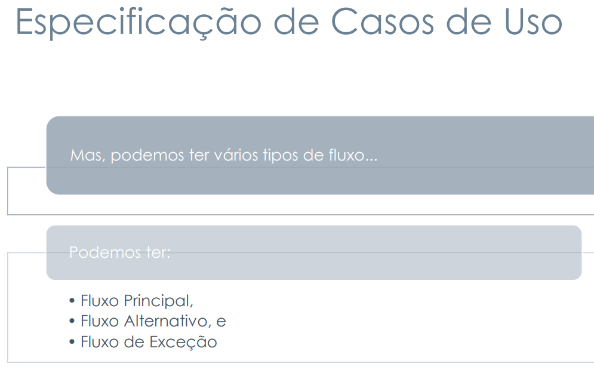

# Planejamento da Verificação da Etapa 2 do Grupo

## Introdução

O artefato visa apresentar o planejamento para a verificação de cada artefato da etapa 3 do projeto (Modelagem de Requisitos) do [grupo](https://github.com/Requisitos-de-Software/2024.2-TesouroDireto).

## Objetivos

O objetivo deste documento é verificar se os artefatos produzidos para entrega 3 do [grupo](https://github.com/Requisitos-de-Software/2024.2-TesouroDireto) possuem os itens e o padrão exigidos. É importante citar que essa verificação em momento nenhum busca diminuir os membros responsáveis seu trabalho, apenas aplicar os conceitos de verificação.

## Metodologia

A metodologia escolhida para esta verificação é uma adaptação da inspeção. Desenvolvida originalmente para códigos de software por Fagan na IBM em 1976, essa técnica consiste em uma revisão formal dos artefatos produzidos a fim de se encontrar defeitos, a figura 1 exemplifica as etapas que Fagan propôs para esse processo.

**Figura 1** - Etapas da Inspeção de acordo com Fagan.

_Fonte: SOMMERVILLE (2007)._ <a id="anchor_5" href="#REF5">5</a>

### Objetos da Verificação

Os artefatos alvos dessa verificação são:

- [Léxicos](../../../modelagem/lexicos.md) na versão 1.0 de data 28/11/2024, produzido por [Thales Euflauzino](https://github.com/thaleseuflauzino) com revisão de [Maria Helena](https://github.com/MariaCHelena).
- [Cenários](../../../modelagem/cenarios.md) na versão XX de data XX/12/2024, produzido por [XX](https://github.com/XX) e revisado por [XX](https://github.com/XX).
- [XX](../../../XX/XX/XX.md) na versão XX de data XX/12/2024, produzido por [XX](https://github.com/XX) com revisão de [XX](https://github.com/XX).
- [XX](../../../XX/XX/XX.md) na versão XX de data XX/12/2024, produzido por [XX](https://github.com/XX) com revisão de [XX](https://github.com/XX).
- [XX](../../../XX/XX/XX.md) na versão XX de data XX/12/2024, produzido por [XX](https://github.com/XX) com revisão de [XX](https://github.com/XX).

### Resultados das Verificações

Os resultados das verificações podem ser acessados através do seguinte link:

- [Relatório da Verificação](./relatorio-verificacao-e3-gp5.md);

### Cronograma

A verificação será realizada no período de 07 de dezembro de 2024, com os resultados sendo relatados através da página de documentação do Grupo 5 no dia 07 de dezembro de 2024. A tabela 1 a seguir, apresenta o cronograma das atividades a serem realizadas.

**Tabela 1** - Cronograma das Atividades.

| Data       | Descrição                    | Responsável                                 |
| ---------- | ---------------------------- | ------------------------------------------- |
| 22/11/2024 | Planejamento da Verificação  | [Thales Euflauzino](https://github.com/thaleseuflauzino) |
| 23/11/2024 | Adição dos resultados.       |  [Grupo](https://github.com/Requisitos-de-Software/2024.2-TesouroDireto)   |

_Autor: [Thales Euflauzino](https://github.com/thaleseuflauzino), 2024_

## Lista de Verificação

As listas de verificação foram construídas levando em conta os padrões esperados para cada artefato e as principais tarefas realizadas na elaboração dos mesmos, tudo isso de acordo com os slides da _Aula 04 da professora Milene e Maurício Serrano_<a id="anchor_4" href="#REF4">4</a>.

### Geral

 

**Tabela 1** - Lista de Verificação.

|        ID        | Descrição                                                                                                                                                                  | Avaliação   | Autor            | Data e Hora         |
| :--------------: | -------------------------------------------------------------------------------------------------------------------------------------------------------------------------- | :---------: | ----------------- | ------------------- |
| **Itens do desenvolvimentos do projeto** |                                                                                                                                                        |             |                   |                     |
|        1         | Todos os 9 itens       | **RESPOSTA** | André Barros      | **DATA/HORA**       |
| **Itens do conteúdo da disciplina** |                                                                                                                                                        |             |                   |                     |
|        1         | As especificações dos cenários para o projeto.   <a href="../referencias_png/especificacaocenarios.png" target="_blank">Exemplo de especificação dos cenários?</a> <a id="anchor_2" href="#REF2">2</a>       | **RESPOSTA** | André Barros      | **DATA/HORA**       |
|        2         | Os cenários possuem os elementos básicos de um cenário (Título, Metas/Objetivo, Contexto, Atores, Recursos, Exceção e Episódios).   <a href="../referencias_png/elementoscenarios.png" target="_blank">Quais elementos dos cenários?</a> <a id="anchor_2" href="#REF2">2</a>     | **RESPOSTA** | André Barros      | **DATA/HORA**       |
|        3         | As especificações dos léxicos.   <a href="../referencias_png/oqsaolexicos.png" target="_blank">O que são léxicos?</a> <a id="anchor_1" href="#REF1">1</a>                                          | **RESPOSTA** | André Barros      | **DATA/HORA**       |
|        4         | A definição do usuário nos léxicos.                                                                                                                                        | **RESPOSTA** | André Barros      | **DATA/HORA**       |
|        5         | Os léxicos possuem ligações entre si (hiperlinks).                                                                                                                         | **RESPOSTA** | André Barros      | **DATA/HORA**       |
|        6         | Os léxicos utilizam a estrutura de dicionário (verbo, objeto, estado).   <a href="../referencias_png/tiposlexicos.png" target="_blank">O que é o dicionário dos léxicos?</a><a id="anchor_1" href="#REF1">1</a>       | **RESPOSTA** | André Barros      | **DATA/HORA**       |
|        7         | A especificação do caso de uso.                                                                                                                                             | **RESPOSTA** | André Barros      | **DATA/HORA**       |
|        8         | Os atores principais e secundários no diagrama de caso de uso.   <a id="anchor_3" href="#REF3">3 [min. 3:27]</a>.                            | **RESPOSTA** | André Barros      | **DATA/HORA**       |
|        9         | O ator principal está do lado esquerdo do sistema no diagrama de caso de uso.   <a id="anchor_3" href="#REF3">3 [min. 3:57]</a>             | **RESPOSTA** | André Barros      | **DATA/HORA**       |
|       10         | Os atores estão fora da caixa de limite do sistema no diagrama de caso de uso.   <a id="anchor_3" href="#REF3">3 [min. 2:55]</a>            | **RESPOSTA** | André Barros      | **DATA/HORA**       |
|       11         | A especificação do diagrama de caso de uso (com Nome, Descrição, Atores, Pré-Condição, Pós-Condição, Fluxo Principal, Fluxo Alternativo e Fluxo de Exceção etc.).           | **RESPOSTA** | André Barros      | **DATA/HORA**       |
|       12         | No diagrama de caso de uso há ao menos um caso de uso com pontos de extensão?   <a id="anchor_3" href="#REF3">3 [min. 8:35]</a>   | **RESPOSTA** | André Barros      | **DATA/HORA**       |
|       13         | A participação do cliente e/ou persona na validação do diagrama de caso de uso.                                                                                            | **RESPOSTA** | André Barros      | **DATA/HORA**       |
|       14         | A especificação suplementar.   <a href="../referencias_png/oqesuplementar.png" target="_blank">O que é especificação suplementar?</a> <a id="anchor_2" href="#REF2">2</a>                                      | **RESPOSTA** | André Barros      | **DATA/HORA**       | 
|       15         | O artefato segue o modelo FURPS+.                                                                                                                                          | **RESPOSTA** | André Barros      | **DATA/HORA**       |
|       16         | O documento especifica o tempo de resposta, no desempenho?                                                                                                                 | **RESPOSTA** | André Barros      | **DATA/HORA**       |
|       17         | O documento especifica qual plataforma o aplicativo pode ser executado?                                                                                                    | **RESPOSTA** | André Barros      | **DATA/HORA**       |
|       18         | Todos os requisitos podem ser testados (RF e RNF)?   **Identificar quais requisitos não são testáveis/verificáveis.**                                                    | **RESPOSTA** | André Barros      | **DATA/HORA**       |
|       **Itens do Conteúdo da Disciplina** (a foto referente ao texto está no ID)         |   |  |  |  |
|       <a id="anchor_3" href="#REF3">P1</a>         | Todos os elementos necessários no diagrama de caso de uso estão presentes? (atores, relacionamentos, sistemas e casos de uso) <a id="anchor_3" href="#REF3">3 [min. 1:37]. </a>                                                    | **RESPOSTA** | Thales Euflauzino | **DATA/HORA**       |
|       <a id="REF7" href="#anchor_7">P2</a>         | Os casos de uso estão em formato oval na horizontal?                                                   | **RESPOSTA** | Víctor Schmidt      | **DATA/HORA**       |
|       <a id="REF8" href="#anchor_8">P3</a>         | Os fluxos do diagrama de casos de uso são divididos em: Fluxo Principal, Fluxo Alternativo e Fluxo de Exceção | **RESPOSTA** | Victor Rodrigues      | **DATA/HORA**       |
|       <a id="REF9" href="#anchor_9">P4</a>         | Maria Helena                                                   | **RESPOSTA** | Maria Helena      | **DATA/HORA**       |
|       <a id="REF10" href="#anchor_10">P5</a>         | Júlia Takaki                                                   | **RESPOSTA** | Júlia Takaki      | **DATA/HORA**       |

_Autor: [Thales Euflauzino](https://github.com/thaleseuflauzino), 2024._

## Bibliografia
> <a id="REF1" href="#anchor_1">1.</a> SERRANO, Milene; SERRANO, Maurício. Apresentação Modelagem de Requisitos - Cenários, Léxicos e Ferramenta C&L. Brasília: UnB Gama, s.d. 1 apresentação em slides. Disponível em: [https://aprender3.unb.br/pluginfile.php/2972470/mod_resource/content/1/Aula%2010.pdf](https://aprender3.unb.br/pluginfile.php/2972470/mod_resource/content/1/Aula%2010.pdf).
>
> <a id="REF2" href="#anchor_2">2.</a> SERRANO, Milene; SERRANO, Maurício. Apresentação Modelagem de Requisitos - Casos de Uso e Especificação Suplementar. Brasília: UnB Gama, s.d. 1 apresentação em slides. Disponível em: [https://aprender3.unb.br/pluginfile.php/2972480/mod_resource/content/1/Requisitos%20-%20Aula%20013a.pdf](https://aprender3.unb.br/pluginfile.php/2972480/mod_resource/content/1/Requisitos%20-%20Aula%20013a.pdf)
>
> <a id="REF3" href="#anchor_3">3.</a> LUCID SOFTWARE PORTUGUÊS. Tutorial de Caso de Uso UML. YouTube, 25 abr. 2019. Disponível em: [https://youtu.be/ab6eDdwS3rA](https://youtu.be/ab6eDdwS3rA). Acesso em: 28 nov. 2024.
>
> <a id="REF4" href="#anchor_4">4</a> SERRANO, MAURÍCIO; SERRANO, Milene. **Slides da aula Requisitos – Aula 04**. Disponível em: [https://aprender3.unb.br/pluginfile.php/2523041/mod_resource/content/3/Requisitos%20-%20Aula%2004.pdf](https://aprender3.unb.br/pluginfile.php/2523041/mod_resource/content/3/Requisitos%20-%20Aula%2004.pdf). Acesso em: 02 de novembro de 2024.
>
> <a id="REF5" href="#anchor_5">5</a> SOMMERVILLE, Ian. **Engenharia de software.** 08. ed. São Paulo: Pearson Addison Wesley, 2007
>
> SALES, André Barros. Plano de Ensino. Aprender 3. Distrito Federal, 2024. Disponível em: [https://aprender3.unb.br/pluginfile.php/2972367/mod_resource/content/51/Plano_de_Ensino%20RE%20022024%20Turma%2002%20v1.pdf](https://aprender3.unb.br/pluginfile.php/2972367/mod_resource/content/51/Plano_de_Ensino%20RE%20022024%20Turma%2002%20v1.pdf). Acesso em 04 dez. 2024.
>
><a id="anchor_7" href="#REF7">P2</a>      LUCIDCHART. Diagrama de caso de uso UML. Disponível em: [LucidChart](https://www.lucidchart.com/pages/pt/diagrama-de-caso-de-uso-uml). Acesso em: 8 dez. 2024
>****
><a id="anchor_8" href="#REF8">P3</a>        Serrano, Milene; Serrano, Maurício. Requisitos – Aula 13.pdf. Slide 18.
>****
> <a id="anchor_9" href="#REF9">P4</a>         HELENA   ADICIONE SE HOUVER REFERENCIA DE IMAGEM, SE NAO TIRE!!!!!!! COLOQUE TAMBÉM NO PLANEJAMENTO
>****
> <a id="anchor_10" href="#REF10">P5</a>        TAKAKI   ADICIONE SE HOUVER REFERENCIA DE IMAGEM, SE NAO TIRE!!!!!!! COLOQUE TAMBÉM NO PLANEJAMENTO

## Histórico de Versões

| Versão  | Data | Descrição | Autor(es) | Revisor(es) |
| -------- | ------ | ------ | ---------- | ---------- |
| `1.0` | 04/12/2024 | Criação do documento  | [Thales Euflauzino](https://github.com/thaleseuflauzino) | [Victor Rodrigues](https://github.com/ViictorHugoo) |
| `1.1` | 08/12/2024 | Adição de item de verificação  | [Victor Rodrigues](https://github.com/ViictorHugoo) | |
