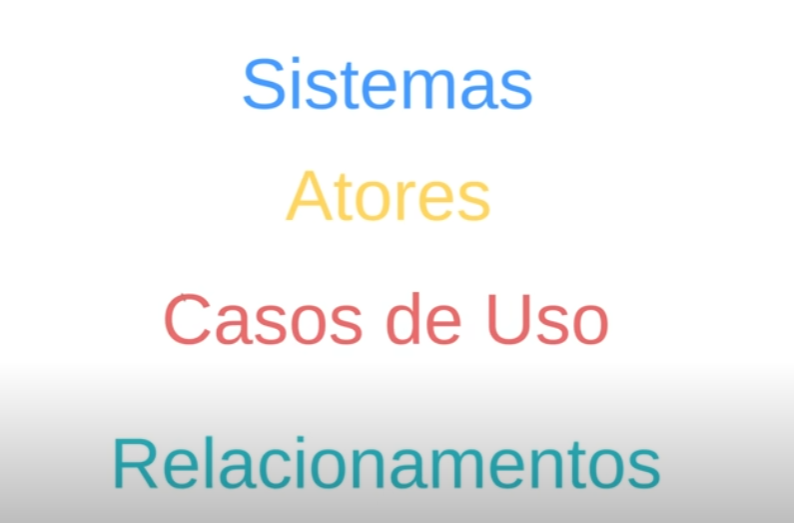
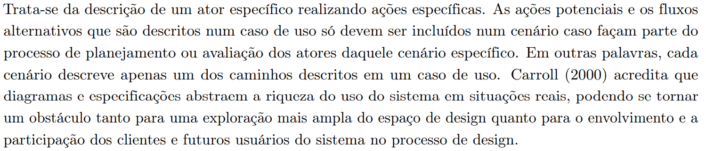
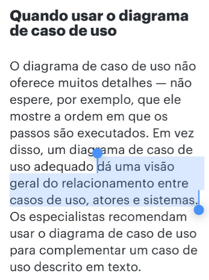

# Verificação dos artefatos

## Introdução

Após o planejamento, realiza-se a inspeção dos artefatos. Este documento apresenta os objetivos da verificação, a metodologia utilizada e a lista de verificação para a avaliação. Além disso, os problemas encontrados poderão conter observações e serão sumarizados e analisados, fornecendo informações valiosas para auxiliar na sua correção.

## Objetivo

O objetivo deste documento é relatar os resultados das verificações realizadas acerca dos artefatos produzidos pelo [grupo](https://github.com/Requisitos-de-Software/2024.2-TesouroDireto) durante a etapa 3.

## Metodologia

Os resultados da verificação do artefato foram obtidos a partir da lista de verificação elaborada na página de [planejamento](../entrega3/planej-verificacao-e3-gp5.md) Para responder às perguntas apresentadas na lista de verificação, o avaliador usará as opções **Sim**, **Não** ou **Incompleto**. O avaliador poderá, também, escrever observações em cada pergunta, detalhando pontos que achar necessários.

### Cronograma e Participantes

Os participantes da verificação são todos integrantes do grupo. [Víctor Schmidt](https://github.com/moonshinerd), que irá verificar e corrigir possíveis problemas com os outros integrantes do grupo. E o integrante do grupo [Thales Euflauzino](https://github.com/thaleseuflauzino) realizará a revisão da avaliação. Em relação ao cronograma seguido, ele já foi explicitado na página de [planejamento](../entrega3/planej-verificacao-e3-gp5.md).

**Tabela 1** - Lista de Verificação.

|        ID        | Descrição                                                                                                                                                                  | Avaliação   | Autor            | Data e Hora         |
| :--------------: | -------------------------------------------------------------------------------------------------------------------------------------------------------------------------- | :---------: | ----------------- | ------------------- |
| **Itens do desenvolvimentos do projeto** |                                                                                                                                                        |             |                   |                     |
|        1         | Todos os 9 itens       | **Sim** | André Barros      | **08/12/2024 15:20**       |
| **Itens do conteúdo da disciplina** |                                                                                                                                                        |             |                   |                     |
|        1         | As especificações dos cenários para o projeto.   <a href="../referencias_png/especificacaocenarios.png" target="_blank">Exemplo de especificação dos cenários?</a> <a id="anchor_2" href="#REF2">2</a>       | **Sim** | André Barros      | **08/12/2024 15:20**       |
|        2         | Os cenários possuem os elementos básicos de um cenário (Título, Metas/Objetivo, Contexto, Atores, Recursos, Exceção e Episódios).   <a href="../referencias_png/elementoscenarios.png" target="_blank">Quais elementos dos cenários?</a> <a id="anchor_2" href="#REF2">2</a>     | **Sim** | André Barros      | **08/12/2024 15:20**       |
|        3         | As especificações dos léxicos.   <a href="../referencias_png/oqsaolexicos.png" target="_blank">O que são léxicos?</a> <a id="anchor_1" href="#REF1">1</a>                                          | **Sim** | André Barros      | **08/12/2024 15:20**       |
|        4         | A definição do usuário nos léxicos.                                                                                                                                        | **Sim** | André Barros      | **08/12/2024 15:20**       |
|        5         | Os léxicos possuem ligações entre si (hiperlinks).                                                                                                                         | **Sim** | André Barros      | **08/12/2024 15:20**       |
|        6         | Os léxicos utilizam a estrutura de dicionário (verbo, objeto, estado).   <a href="../referencias_png/tiposlexicos.png" target="_blank">O que é o dicionário dos léxicos?</a><a id="anchor_1" href="#REF1">1</a>       | **Sim** | André Barros      | **08/12/2024 15:20**       |
|        7         | A especificação do caso de uso.                                                                                                                                             | **Sim** | André Barros      | **08/12/2024 15:20**       |
|        8         | Os atores principais e secundários no diagrama de caso de uso.   <a id="anchor_3" href="#REF3">3 [min. 3:27]</a>.                            | **Sim** | André Barros      | **08/12/2024 15:20**       |
|        9         | O ator principal está do lado esquerdo do sistema no diagrama de caso de uso.   <a id="anchor_3" href="#REF3">3 [min. 3:57]</a>             | **Sim** | André Barros      | **08/12/2024 15:20**       |
|       10         | Os atores estão fora da caixa de limite do sistema no diagrama de caso de uso.   <a id="anchor_3" href="#REF3">3 [min. 2:55]</a>            | **Sim** | André Barros      | **08/12/2024 15:20**       |
|       11         | A especificação do diagrama de caso de uso (com Nome, Descrição, Atores, Pré-Condição, Pós-Condição, Fluxo Principal, Fluxo Alternativo e Fluxo de Exceção etc.).           | **Sim** | André Barros      | **08/12/2024 15:20**       |
|       12         | No diagrama de caso de uso há ao menos um caso de uso com pontos de extensão?   <a id="anchor_3" href="#REF3">3 [min. 8:35]</a>   | **Sim** | André Barros      | **08/12/2024 15:20**       |
|       13         | A participação do cliente e/ou persona na validação do diagrama de caso de uso.                                                                                            | **Sim** | André Barros      | **08/12/2024 15:20**       |
|       14         | A especificação suplementar.   <a href="../referencias_png/oqesuplementar.png" target="_blank">O que é especificação suplementar?</a> <a id="anchor_2" href="#REF2">2</a>                                      | **Sim** | André Barros      | **08/12/2024 15:20**       |
|       15         | O artefato segue o modelo FURPS+.                                                                                                                                          | **Sim** | André Barros      | **08/12/2024 15:20**       |
|       16         | O documento especifica o tempo de resposta, no desempenho?                                                                                                                 | **Sim** | André Barros      | **08/12/2024 15:20**       |
|       17         | O documento especifica qual plataforma o aplicativo pode ser executado?                                                                                                    | **Sim** | André Barros      | **08/12/2024 15:20**       |
|       18         | Todos os requisitos podem ser testados (RF e RNF)?   **<a id="#anchor_99" href="#REF99">Lista de requisitos não testáveis/verificáveis</a>**                                                    | **Incompleto** | André Barros      | **08/12/2024 15:20**       |
|       **Itens do Conteúdo da Disciplina** (a foto referente ao texto está no ID)         |   |  |  |  |
|       <a id="anchor_3" href="#REF3">P1</a>         | Todos os elementos necessários no diagrama de caso de uso estão presentes? (atores, relacionamentos, sistemas e casos de uso) <a id="anchor_3" href="#REF3">3 [min. 1:37]. </a>                                                    | **Sim** | Thales Euflauzino | **08/12/2024 15:20**       |
|       <a id="REF7" href="#anchor_7">P2</a>         | Os casos de uso estão em formato oval na horizontal?                                                   | **Sim** | Víctor Schmidt      | **08/12/2024 15:20**       |
|       <a id="REF8" href="#anchor_8">P3</a>         | Os fluxos do diagrama de casos de uso são divididos em: Fluxo Principal, Fluxo Alternativo e Fluxo de Exceção | **Sim** | Victor Rodrigues      | **08/12/2024 15:20**       |
|       <a id="REF9" href="#anchor_9">P4</a>         | Os cenários descrevem apenas um único caminho específico feito pelo ator específico realizando ações específicas?                                                   | **Sim** | Maria Helena      | **08/12/2024 15:20**       |
|       <a id="REF10" href="#anchor_10">P5</a>         | O diagrama de caso de uso dá uma visão geral do relacionamento entre casos de uso, atores e sistemas?                  | **Sim** | Júlia Takaki      | **08/12/2024 15:20**       |

_Autor: [Thales Euflauzino](https://github.com/thaleseuflauzino), 2024._

## Vídeo da Verificação

[**Vídeo 1:** Requisitos - Verificação Entrega 2](https://youtu.be/2j-YhQfrKLQ)

<iframe width="560" height="315" src="https://www.youtube.com/embed/2j-YhQfrKLQ" title="YouTube video player" frameborder="0" allow="accelerometer; autoplay; clipboard-write; encrypted-media; gyroscope; picture-in-picture; web-share" referrerpolicy="strict-origin-when-cross-origin" allowfullscreen></iframe>

_Autor: [Thales Euflauzino](https://github.com/thaleseuflauzino), 2024_

---

## Requisitos não testáveis/verificáveis
Na tabela 2 estão listados os requisitos funcionais e não funcionais elicitados que não podem ser testados ou verificados.

**Tabela 2** - Requisitos elicitados não testáveis/verificáveis.

| Requisito             | Rastreabilidade (Link)                                                                |
|-----------------------|---------------------------------------------------------------------------------------|
| RF22                 | [RF22](../../../../elicitacao/grupo5/requisitos/#anchor_RF22)                          |
| RF26                 | [RF26](../../../../elicitacao/grupo5/requisitos/#anchor_RF26)                          |
| RF29                 | [RF29](../../../../elicitacao/grupo5/requisitos/#anchor_RF29)                          |
| RNF04                | [RNF04](../../../../elicitacao/grupo5/requisitos/#anchor_RNF04)                        |
| RNF05                | [RNF05](../../../../elicitacao/grupo5/requisitos/#anchor_RNF05)                        |
| RNF07                | [RNF07](../../../../elicitacao/grupo5/requisitos/#anchor_RNF07)                        |
| RNF08                | [RNF08](../../../../elicitacao/grupo5/requisitos/#anchor_RNF08)                        |

_Autor: [Thales Euflauzino](https://github.com/thaleseuflauzino), 2024_

## Bibliografia

> <a id="REF1" href="#anchor_1">1.</a> SERRANO, Milene; SERRANO, Maurício. Apresentação Modelagem de Requisitos - Cenários, Léxicos e Ferramenta C&L. Brasília: UnB Gama, s.d. 1 apresentação em slides. Disponível em: [https://aprender3.unb.br/pluginfile.php/2972470/mod_resource/content/1/Aula%2010.pdf](https://aprender3.unb.br/pluginfile.php/2972470/mod_resource/content/1/Aula%2010.pdf).
>
> <a id="REF2" href="#anchor_2">2.</a> SERRANO, Milene; SERRANO, Maurício. Apresentação Modelagem de Requisitos - Casos de Uso e Especificação Suplementar. Brasília: UnB Gama, s.d. 1 apresentação em slides. Disponível em: [https://aprender3.unb.br/pluginfile.php/2972480/mod_resource/content/1/Requisitos%20-%20Aula%20013a.pdf](https://aprender3.unb.br/pluginfile.php/2972480/mod_resource/content/1/Requisitos%20-%20Aula%20013a.pdf)
>
> <a id="REF3" href="#anchor_3">3.</a> LUCID SOFTWARE PORTUGUÊS. Tutorial de Caso de Uso UML. YouTube, 25 abr. 2019. Disponível em: [https://youtu.be/ab6eDdwS3rA](https://youtu.be/ab6eDdwS3rA). Acesso em: 28 nov. 2024.
>
> SALES, André Barros. Plano de Ensino. Aprender 3. Distrito Federal, 2024. Disponível em: [https://aprender3.unb.br/pluginfile.php/2972367/mod_resource/content/51/Plano_de_Ensino%20RE%20022024%20Turma%2002%20v1.pdf](https://aprender3.unb.br/pluginfile.php/2972367/mod_resource/content/51/Plano_de_Ensino%20RE%20022024%20Turma%2002%20v1.pdf). Acesso em 04 dez. 2024.
> <a id="REF3" href="#anchor_3">P1</a> LUCID SOFTWARE PORTUGUÊS. Tutorial de Caso de Uso UML. YouTube, 25 abr. 2019. Disponível em: [https://youtu.be/ab6eDdwS3rA](https://youtu.be/ab6eDdwS3rA). Min 1:37. Acesso em: 28 nov. 2024.
> ****
><a id="anchor_7" href="#REF7">P2</a>      LUCIDCHART. Diagrama de caso de uso UML. Disponível em: [LucidChart](https://www.lucidchart.com/pages/pt/diagrama-de-caso-de-uso-uml). Acesso em: 8 dez. 2024
>****
><a id="anchor_8" href="#REF8">P3</a>        Serrano, Milene; Serrano, Maurício. Requisitos – Aula 13.pdf. Slide 18.
>****
> <a id="anchor_9" href="#REF9">P4</a>         BARBOSA, S. D. J.; SILVA, B. S. da; SILVEIRA, M. S.; GASPARINI, I.; DARIN, T.; BARBOSA, G. D. J. Interação Humano-Computador e Experiência do Usuário. Autopublicação, 2021. ISBN: 978-65-00-19677-1.
>****
> <a id="anchor_10" href="#REF10">P5</a>   LUCIDCHART. Diagrama de caso de uso UML. Disponível em: [LucidChart](https://www.lucidchart.com/pages/pt/diagrama-de-caso-de-uso-uml). Acesso em: 8 dez. 2024

## Histórico de Versões

| Versão  | Data | Descrição | Autor(es) | Revisor(es) |
| -------- | ------ | ------ | ---------- | ---------- |
| `1.0` | 04/12/2024 | Criação do documento  | [Thales Euflauzino](https://github.com/thaleseuflauzino) | [Victor Rodrigues](https://github.com/ViictorHugoo) |
| `1.1` | 08/12/2024 | Adição de item de verificação  | [Victor Rodrigues](https://github.com/ViictorHugoo) |[Thales Euflauzino](https://github.com/thaleseuflauzino) |
| `1.2` | 08/12/2024 | Adição de item de verificação (Maria Helena)  | [Maria Helena](https://github.com/MariaCHelena) | [Thales Euflauzino](https://github.com/thaleseuflauzino) |
| `1.3` | 08/12/2024 | Adicionando respostas da verificação  | [Thales Euflauzino](https://github.com/thaleseuflauzino) | [Victor Schmidt](https://github.com/moonshinerd) |
| `1.4` | 08/12/2024 | Adicionando gravação da verificação  | [Thales Euflauzino](https://github.com/thaleseuflauzino) | [Victor Schmidt](https://github.com/moonshinerd)  |
