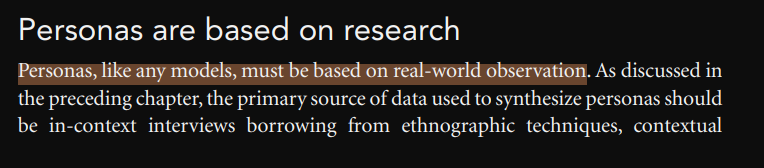
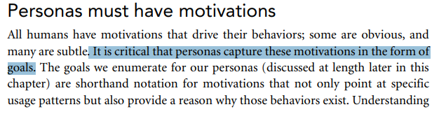
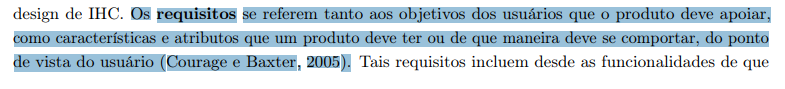
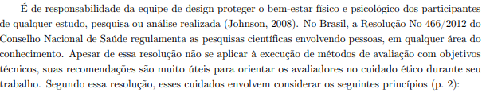
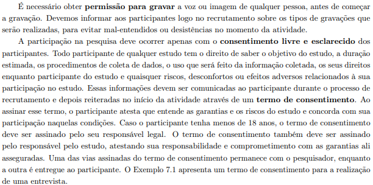

# Verificação dos artefatos

## Introdução

Após o planejamento, realiza-se a inspeção dos artefatos. Este documento apresenta os objetivos da verificação, a metodologia utilizada e a lista de verificação para a avaliação. Além disso, os problemas encontrados poderão conter observações e serão sumarizados e analisados, fornecendo informações valiosas para auxiliar na sua correção.

## Objetivo

O objetivo deste documento é relatar os resultados das verificações realizadas acerca dos artefatos produzidos pelo [grupo 6](https://github.com/Requisitos-de-Software/2024.2-MeuINSS) durante a etapa 2.

## Metodologia

Os resultados da verificação do artefato foram obtidos a partir da lista de verificação elaborada na página de [planejamento](../entrega2/planej-verificacao-e2-gp6.md) Para responder às perguntas apresentadas na lista de verificação, o avaliador usará as opções **Sim**, **Não** ou **Incompleto**. O avaliador poderá, também, escrever observações em cada pergunta, detalhando pontos que achar necessários.

### Cronograma e Participantes

Os participantes da verificação são integrantes do grupo. todo o grupo ira verificar os possíveis problemas no projeto do grupo 6. Em relação ao cronograma seguido, ele já foi explicitado na página de [planejamento](../entrega1/planej-verificacao-e1-gp6.md).

**Tabela 1** - Lista de Verificação.

|        ID        | Descrição                                                                                                           | Avaliação  | Autor        | Data e hora |
| :--------------: | ------------------------------------------------------------------------------------------------------------------- | :--------: | ------------ | ------------- |
| **Itens do Desenvolvimento do projeto** |                                                                                                                     |            |              |               |
|        1         | 1 - A Especificação do Perfil do usuário possui informação de:   • Idade (criança, jovem, adulto, terceira idade etc.);   • Experiência (leigo/ novato, especialista);   • Atitudes (tecnófilos, tecnófobos);   • tarefas primárias (compra, venda)                       |    RESPOSTA     | André Barros |         25/11/2024 20:30 |
|        2         | Um cronograma (data e horário) e local para realização da elicitação dos requisitos com o do cliente e/ou persona do projeto? | RESPOSTA | André Barros |     25/11/2024 20:30     |
|        3         | No mínimo três técnicas de elicitação foram utilizadas (quanto mais melhor)?                                                                                           |    RESPOSTA     | André Barros |    25/11/2024 20:30      |
|        4         | A participação do cliente e/ou persona na elicitação de requisitos?                                             |    RESPOSTA     | André Barros |        25/11/2024 20:30  |
|        5         | A gravação e o(s) registro(s) da elicitação dos requisitos (pré-rastreabilidade)?                                                                                             |    RESPOSTA     | André Barros |    25/11/2024 20:30      |
|        6         | Um cronograma (data e horário) e local para realização da priorização dos requisitos com o do cliente e/ou persona do projeto?    |    RESPOSTA     | André Barros |      25/11/2024 20:30    |
|        7         | No mínimo duas técnicas de priorização (quanto mais melhor)?   * A técnica de MoSCoW* / 100 $* só devem ser  utilizados no projeto após a utilização de outras duas técnicas de priorização no  projeto.                                                      |    RESPOSTA     | André Barros |        25/11/2024 20:30  |
|        8         | A participação do cliente e/ou persona no processo de priorização?                                                                                   |    RESPOSTA     | André Barros |       25/11/2024 20:30   |
|        9         | A gravação e o(s) registro(s) da atividade de priorização dos requisitos?                                                                               |    RESPOSTA     | André Barros |      25/11/2024 20:30    |
| **Itens do Conteúdo da Disciplina** (a foto referente ao texto está no ID) |                                                                                                                     |            |              |               |
|        <a id="REF1" href="#anchor_1">P1</a>        | As personas são criadas a partir de observações do mundo real?                                                                            |    RESPOSTA     | Thales Euflauzino |  25/11/2024 20:30 |
|        <a id="REF2" href="#anchor_2">P2</a>        | As personas possuem objetivos bem esclarecidos?  |    RESPOSTA     | Victor Rodrigues |      25/11/2024 20:30    |
|        <a id="REF3" href="#anchor_3">P3</a>        | Os requisitos elicitados consideram tanto os objetivos dos usuários quanto as características e atributos do produto? |    RESPOSTA     | Víctor Schmidt |      25/11/2024 20:30    |
|        <a id="REF4" href="#anchor_4">P4</a>        | 	O questionário considera variáveis demográficas, como idade e localização geográfica, apenas quando elas têm impacto direto no comportamento e nas interações dos usuários com o sistema?  |    RESPOSTA     | Julia Takaki |      25/11/2024 20:30    |
|        <a id="REF5" href="#anchor_5">P5</a>        | Há alguma comprovação do consentimento para o uso e a divulgação dos dados e das imagens dos participantes dos estudos, pesquisas e análises realizados nesta etapa, por meio da assinatura de um termo de consentimento? |    RESPOSTA     | Maria Helena |       25/11/2024 20:30   |

_Autor: [Thales Euflauzino](https://github.com/thaleseuflauzino), 2024._

## Vídeo da Verificação

[**Vídeo 1:** Requisitos - Verificação Entrega 2](Adicionar link)

[video]

_Autor: [Victor Rodrigues](https://github.com/ViictorHugoo), 2024_

---
## Bibliografia

> BARBOSA, Simone D. J. et al. Interação Humano-Computador e Experiência do Usuário. Rio de Janeiro: [s.n.], 2021.
>
> COOPER, Alan; REIMANN, Robert; CRONIN, Dave. About Face 3: The Essentials of Interaction Design. 3. ed. Indianapolis: Wiley Publishing, 2007. ISBN  978-0-470-08411-3
>
> SALES, André Barros. Plano de Ensino. Aprender 3. Distrito Federal, 2024. Disponível em: [https://aprender3.unb.br/pluginfile.php/2972367/mod_resource/content/51/Plano_de_Ensino%20RE%20022024%20Turma%2002%20v1.pdf](https://aprender3.unb.br/pluginfile.php/2972367/mod_resource/content/51/Plano_de_Ensino%20RE%20022024%20Turma%2002%20v1.pdf). Acesso em 28 out. 2024.
>
> Verificação - Bilheteria Digital. Disponível em: <https://requisitos-de-software.github.io/2023.1-BilheteriaDigital/verificacao/grupo/entrega1/verificacao-rich-picture/>. Acesso em 02 de novembro de 2024.
>****
> REQUISITOS DE SOFTWARE. Documentação do projeto Meu INSS. Disponível em: [https://requisitos-de-software.github.io/2024.2-MeuINSS/](https://requisitos-de-software.github.io/2024.2-MeuINSS/). Acesso em: 24 nov. 2024.
>****
><a id="anchor_1" href="#REF1">P1</a> 
>****
><a id="anchor_2" href="#REF2">P2</a> 
>****
><a id="anchor_3" href="#REF3">P3</a> 
>****
> <a id="anchor_4" href="#REF4">P4</a> 
>****
> <a id="anchor_5" href="#REF5">P5</a>  

## Histórico de Versões

| Versão  | Data | Descrição | Autor(es) | Revisor(es) |
| -------- | ------ | ------ | ---------- | ---------- |
| `1.0` | 25/11/2024 | Criação do documento  | [Grupo](https://requisitos-de-software.github.io/2024.2-TesouroDireto/) | [Grupo](https://requisitos-de-software.github.io/2024.2-TesouroDireto/)|
